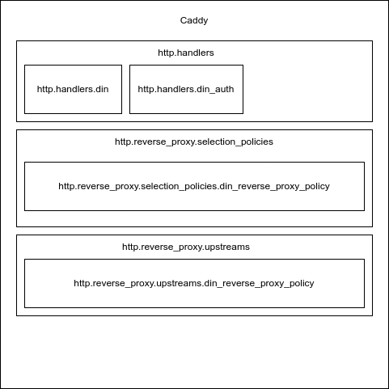

# General Design

The DIN Proxy is built on Caddy, which is an open source reverse proxy written in Go. The [github.com/din-center/din-caddy-plugins](https://github.com/din-center/din-caddy-plugins) project implements several Caddy Modules that enable requests to be routed to different providers based on which providers are able to serve which requests, the priority of those providers, and the health status of each provider.

# Caddy Modules

The following headers indicate the DIN plugin implementations of [Caddy’s Module Namespaces](https://caddyserver.com/docs/extending-caddy/namespaces). Most of the Caddy configuration is parsed by the `http.handlers.din` middleware’s `UnmarshalCaddyFile()` method, and passed to other modules.

> **_Warning:_** 
> 
> A weird quirk of Caddy is that CaddyModules are JSON serialized and deserialized between the `UnmarshalCaddyFile()` step and the `Provision()` step. This can lead to some unexpected behaviors that it’s important to be aware of.
> 1. Any private struct fields on the module (fields starting with lowercase letters) will be unset between `UnmarshalCaddyFile()` and `Provision()`.
> 2. Any goroutines started in the `UnmarshalCaddyFile()` step (such as health checks and maintaining API tokens) will be interacting with a different instance of the module than later steps. If goroutines are needed to maintain the state of a CaddyModule struct, they should be started in the `Provision()` step

## http.handlers

Caddy Middleware Handlers have the opportunity to manipulate requests before they are dispatched to the backend services, and the opportunity to manipulate responses before they are sent to clients.

### http.handlers.din - DIN Router Middleware

Caddyfile Example:

```
din {
	services {
		holesky {
			methods web3_sha3 web3_clientVersion net_listening #...
			providers {
				https://provider:443/api=key {
					priority 0
				}
				https://provider2:443/v1/key {
					priority 1
				}
                https://din.rivet.cloud:443/holesky {
		    		auth {
						type siwe
						url https://din.rivet.cloud/auth
						signer {
							secret_file /run/secrets/din-secret-key
						}
					}
					priority 2
				}
			}
		}
	}
}
```

The Caddy Middleware Module identifies distinct services (typically corresponding to web3 networks). Each service tracks which RPC methods are supported by that network, and which providers are available to serve that network. Each provider keeps track of:
* The URL for the provider. Right now, this must be an https address with a valid certificate, and the port number must be included in the config.
* Headers: A map of key-value pairs that the router should send to this provider with each request.
* Priority: A priority level indicating how this provider should be ranked relative to other providers. This number must be an integer less than the number of providers for the service.
* Auth: The authentication protocol for this provider

When a request comes in the middleware identifies which providers are eligible to serve this request and attaches that to the request object. It attempts the request with a configurable number of retries, processes some metrics, and returns the response to the user.

### http.handlers.din_auth - DIN Authentication Middleware
The DIN Authentication Middleware doesn’t run on the gateway router, but rather runs on a proxy on the provider side to handle the authentication protocol. Details for the authentication protocol, as documented [here](https://docs.google.com/document/d/1ij3SGpkxNpYToEpJSztGX388FK3Xd5T3MzMGgF6iauM/edit#heading=h.dhke5p1t8lhp).

## http.reverse_proxy.upstreams

Caddy Upstreams modules provide a list of Upstreams that are able to handle the specified request.

### http.reverse_proxy.upstreams.din_reverse_proxy_policy

DIN’s upstreams module takes the provider list attached to the request by the DIN Router Middleware and selects which ones are eligible to serve this request. It makes this determined based on the configured priority for the provider, and the availability according to healthchecks.

## http.reverse_proxy.selection_policies
Caddy selection policies select one of the upstreams indicated by Caddy Upstreams Module to be the one that serves the current request.

### http.reverse_proxy.selection_policies.din_reverse_proxy_policy

DIN’s selection policy reviews the providers offered by the Upstreams module, selects one to send traffic to, and makes adjustments to the request as necessary for the specific provider. These request adjustments can include adding authentication headers, changing the request’s path, and signing the request with the DIN Authentication system.

Note that the primary selection criteria uses Caddy’s native HeaderHashSelection selector on the 
“Din-Session-Id” header. This means that requests for a given Din-Session-Id will always be routed to the same provider to help ensure session consistency.

# Authentication

The [DIN Authentication Protocol](https://docs.google.com/document/d/1ij3SGpkxNpYToEpJSztGX388FK3Xd5T3MzMGgF6iauM/edit#heading=h.dhke5p1t8lhp) is described in detail in another document, but this document will cover some implementation of the protocol as it pertains to the proxy.

## Client

The DIN Authentication Client runs on the DIN Router. For each provider authenticated by the DIN Authentication Protocol, a SIWEClientAuth instance is created and started. The background process for the client will establish a configurable number of sessions, and will automatically renew those sessions shortly before expiration. For providers that implement the authentication protocol, requests will be signed during the `http.reverse_proxy.selection_policies.din_reverse_proxy_policy` process.

## Server

The DIN Authentication Server runs on the DIN Provider’s proxy. 

Requests for `/auth` will validate a signed message and issue a session key. The issued session keys are JWT Tokens. The signing server should have a secret key used to sign HMAC JWT Tokens. If a provider runs multiple instances of the DIN proxy, each instance should be configured with the same secret so that each instance can validate session keys regardless of which instance they were issued by.

Requests for `/` will pass through the middleware, primarily to facilitate health checks of the proxy.

Any other request will look for a JWT token in the `x-api-key` header, validate that token using the secret key, and pass the request through to the next middleware.

# Healthchecks

In the Middleware's `Provision()` step, a goroutine is started to monitor each Provider. These health checks get the block number from each provider. The method for retrieving the block number is configurable per network. If a provider fails to return a block number at all, the provider is immediately marked as unhealthy. If the block number falls behind other providers by a configurable limit (default 5 blocks), the provider will be marked as unhealthy. Once a provider is marked as unhealthy, it will not return to "healthy" status until it catches up to the latest block seen from any provider on the network.

The `http.reverse_proxy.upstreams.din_reverse_proxy_policy` module that evaluates each request to determine which providers are eligible to serve a given request looks at the healthcheck status of each provider.