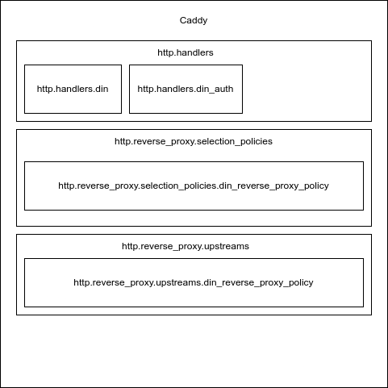

# DIN Caddy Plugins

A collection of Caddy server plugins for the DIN (Decentralized Infrastructure Network) project.

## Features

- **Multi-Network Support**: Route requests to different blockchain networks
- **Provider Load Balancing**: Automatically distribute requests across multiple providers
- **Health Monitoring**: Continuously check provider health and availability
- **Chain ID Configuration**: Explicit chain ID support for all networks using standard formats
- **Environment Support**: Configurable environments (prod, beta, dev, test) with standardized logging
- **Archive Node Support**: Dedicated configuration for archive nodes
- **AI Model Routing**: Route AI API requests across providers (OpenAI, Anthropic, etc.) with tier-based selection, streaming support, and health-aware failover

## Configuration

### Basic Structure

# General Design

The DIN Proxy is built on Caddy, which is an open source reverse proxy written in Go. The [github.com/din-center/din-caddy-plugins](https://github.com/din-center/din-caddy-plugins) project implements several Caddy Modules that enable requests to be routed to different providers based on which providers are able to serve which requests, the priority of those providers, and the health status of each provider.

# Caddy Modules

The following headers indicate the DIN plugin implementations of [Caddy's Module Namespaces](https://caddyserver.com/docs/extending-caddy/namespaces). Most of the Caddy configuration is parsed by the `http.handlers.din` middleware's `UnmarshalCaddyFile()` method, and passed to other modules.

> **_Warning:_** 
> 
> A weird quirk of Caddy is that CaddyModules are JSON serialized and deserialized between the `UnmarshalCaddyFile()` step and the `Provision()` step. This can lead to some unexpected behaviors that it's important to be aware of.
> 1. Any private struct fields on the module (fields starting with lowercase letters) will be unset between `UnmarshalCaddyFile()` and `Provision()`.
> 2. Any goroutines started in the `UnmarshalCaddyFile()` step (such as health checks and maintaining API tokens) will be interacting with a different instance of the module than later steps. If goroutines are needed to maintain the state of a CaddyModule struct, they should be started in the `Provision()` step

## http.handlers

Caddy Middleware Handlers have the opportunity to manipulate requests before they are dispatched to the backend services, and the opportunity to manipulate responses before they are sent to clients.

### http.handlers.din_ai - DIN AI Router Middleware

The AI Router Middleware routes `POST /v1/chat/completions` requests across AI model providers (OpenAI, Anthropic, DeepSeek, Groq, etc.) with health-aware load balancing and streaming support.

**Key Features:**
- **Quality Tiers** (fast, balanced, premium) — clients select via `X-DIN-Tier` header
- **Cost Optimization** — `X-DIN-Optimize` header selects `latency`, `cost`, or `balanced` provider selection within a tier
- **SSE Streaming** with pre-first-byte failover — validates the first chunk before committing to the client
- **Deterministic Session Routing** — `X-DIN-Session-Id` header consistently routes to the same provider via FNV-32a hashing (works across all proxy instances with zero shared state)
- **TTFT-Weighted Selection** — for non-session traffic, faster providers receive more traffic (default mode)
- **Cost Tracking** — `X-DIN-Cost` response header and `din_ai_cost_total_usd` Prometheus metric
- **Provider Health Checks** — periodic lightweight completions with automatic state transitions (healthy → warning → unhealthy)
- **Protocol Translation** — Anthropic Messages API is translated to/from OpenAI format via the adapter pattern

**Provider Support:**

| Provider | Adapter | Notes |
|----------|---------|-------|
| OpenAI, Groq, DeepSeek, Together AI, Fireworks, Mistral, xAI, Google Gemini | `openai` (passthrough) | Natively OpenAI-compatible |
| Anthropic | `anthropic` (translation) | Bidirectional protocol translation |

**Request Headers** (client → DIN):

| Header | Required | Default | Purpose |
|--------|----------|---------|---------|
| `X-DIN-Tier` | No | `balanced` | Quality tier: `fast`, `balanced`, or `premium` |
| `X-DIN-Session-Id` | No | — | Session ID for deterministic provider selection (takes priority over optimize mode) |
| `X-DIN-Optimize` | No | `latency` | Provider selection strategy: `latency` (TTFT-weighted), `cost` (cheapest first), or `balanced` (60/40 cost/latency) |

**Response Headers** (DIN → client):

| Header | Purpose |
|--------|---------|
| `X-DIN-Provider` | Which provider handled the request |
| `X-DIN-Model` | Which model was used |
| `X-DIN-Tier` | Which tier was resolved |
| `X-DIN-Session-Pinned` | `true` when session routing is active |
| `X-DIN-Request-Id` | Unique request ID |
| `X-DIN-Cost` | Estimated cost in USD (6 decimal places). For streaming, cost is sent as `: din-cost <value>` SSE comment after `[DONE]` |

Caddyfile Example:

```
:8000 {
    route /v1/* {
        din_ai {
            healthcheck_interval 30
            healthcheck_threshold 3
            request_attempt_count 3

            tiers {
                fast {
                    providers {
                        groq-llama https://api.groq.com/openai/v1/chat/completions {
                            model llama-3.1-8b-instant
                            adapter openai
                            headers {
                                Authorization "Bearer {env.GROQ_API_KEY}"
                            }
                            cost {
                                input_per_1m 0.06
                                output_per_1m 0.06
                            }
                        }
                    }
                }
                balanced {
                    providers {
                        openai-gpt4o https://api.openai.com/v1/chat/completions {
                            model gpt-4o
                            adapter openai
                            headers {
                                Authorization "Bearer {env.OPENAI_API_KEY}"
                            }
                            cost {
                                input_per_1m 2.50
                                output_per_1m 10.00
                            }
                        }
                        openai-o3 https://api.openai.com/v1/chat/completions {
                            model o3-mini
                            adapter openai
                            health_check {
                                max_completion_tokens 1
                            }
                            headers {
                                Authorization "Bearer {env.OPENAI_API_KEY}"
                            }
                            cost {
                                input_per_1m 1.10
                                output_per_1m 4.40
                            }
                        }
                        anthropic-sonnet https://api.anthropic.com/v1/messages {
                            model claude-sonnet-4-20250514
                            adapter anthropic
                            headers {
                                x-api-key {env.ANTHROPIC_API_KEY}
                                anthropic-version 2023-06-01
                            }
                            cost {
                                input_per_1m 3.00
                                output_per_1m 15.00
                            }
                        }
                    }
                }
            }
        }
    }
}
```

The middleware overwrites the client's `model` field with the provider's configured model — users control model selection via tier, not directly. Requests without `Content-Type: application/json` receive 415 Unsupported Media Type. When all providers in a tier are unhealthy, the middleware returns 503 Service Unavailable.

**Provider Options:**

| Option | Required | Description |
|--------|----------|-------------|
| `model` | Yes | Model ID sent to the backend |
| `adapter` | No | `openai` (default) or `anthropic` |
| `headers` | No | Static headers (e.g. `Authorization`) |
| `cost` | **Yes** | Cost per 1M tokens in USD (`input_per_1m` and `output_per_1m`). Used for cost-based routing and cost headers |
| `health_check` | No | Override health check request params (e.g. `max_completion_tokens 1` for reasoning models) |

The `health_check` block is needed for OpenAI reasoning models (o3, o1) which require `max_completion_tokens` instead of `max_tokens`. Without it, health checks default to `max_tokens: 1`.

### http.handlers.din - DIN Router Middleware

Caddyfile Example:

```
din {
	services {
		holesky {
			methods web3_sha3 web3_clientVersion net_listening #...
			providers {
				https://provider:443/api=key {
					priority 0
				}
				https://provider2:443/v1/key {
					priority 1
				}
                https://din.rivet.cloud:443/holesky {
		    		auth {
						type siwe
						url https://din.rivet.cloud/auth
						signer {
							secret_file /run/secrets/din-secret-key
						}
					}
					priority 2
				}
			}
		}
	}
}
```

The Caddy Middleware Module identifies distinct services (typically corresponding to web3 networks). Each service tracks which RPC methods are supported by that network, and which providers are available to serve that network. Each provider keeps track of:
* The URL for the provider. Right now, this must be an https address with a valid certificate, and the port number must be included in the config.
* Headers: A map of key-value pairs that the router should send to this provider with each request.
* Priority: A priority level indicating how this provider should be ranked relative to other providers. This number must be an integer less than the number of providers for the service.
* Auth: The authentication protocol for this provider

When a request comes in the middleware identifies which providers are eligible to serve this request and attaches that to the request object. It attempts the request with a configurable number of retries, processes some metrics, and returns the response to the user.

### http.handlers.din_auth - DIN Authentication Middleware
The DIN Authentication Middleware doesn't run on the gateway router, but rather runs on a proxy on the provider side to handle the authentication protocol. Details for the authentication protocol, as documented [here](https://docs.google.com/document/d/1ij3SGpkxNpYToEpJSztGX388FK3Xd5T3MzMGgF6iauM/edit#heading=h.dhke5p1t8lhp).

## http.reverse_proxy.upstreams

Caddy Upstreams modules provide a list of Upstreams that are able to handle the specified request.

### http.reverse_proxy.upstreams.din_reverse_proxy_policy

DIN's upstreams module takes the provider list attached to the request by the DIN Router Middleware and selects which ones are eligible to serve this request. It makes this determined based on the configured priority for the provider, and the availability according to healthchecks.

## http.reverse_proxy.selection_policies
Caddy selection policies select one of the upstreams indicated by Caddy Upstreams Module to be the one that serves the current request.

### http.reverse_proxy.selection_policies.din_reverse_proxy_policy

DIN's selection policy reviews the providers offered by the Upstreams module, selects one to send traffic to, and makes adjustments to the request as necessary for the specific provider. These request adjustments can include adding authentication headers, changing the request's path, and signing the request with the DIN Authentication system.

Note that the primary selection criteria uses Caddy's native HeaderHashSelection selector on the 
"Din-Session-Id" header. This means that requests for a given Din-Session-Id will always be routed to the same provider to help ensure session consistency.

# Authentication

The [DIN Authentication Protocol](https://docs.google.com/document/d/1ij3SGpkxNpYToEpJSztGX388FK3Xd5T3MzMGgF6iauM/edit#heading=h.dhke5p1t8lhp) is described in detail in another document, but this document will cover some implementation of the protocol as it pertains to the proxy.

## Client

The DIN Authentication Client runs on the DIN Router. For each provider authenticated by the DIN Authentication Protocol, a SIWEClientAuth instance is created and started. The background process for the client will establish a configurable number of sessions, and will automatically renew those sessions shortly before expiration. For providers that implement the authentication protocol, requests will be signed during the `http.reverse_proxy.selection_policies.din_reverse_proxy_policy` process.

## Server

The DIN Authentication Server runs on the DIN Provider's proxy. 

Requests for `/auth` will validate a signed message and issue a session key. The issued session keys are JWT Tokens. The signing server should have a secret key used to sign HMAC JWT Tokens. If a provider runs multiple instances of the DIN proxy, each instance should be configured with the same secret so that each instance can validate session keys regardless of which instance they were issued by.

Requests for `/` will pass through the middleware, primarily to facilitate health checks of the proxy.

Any other request will look for a JWT token in the `x-api-key` header, validate that token using the secret key, and pass the request through to the next middleware.

# Healthchecks

The DIN proxy implements a sophisticated health check system to monitor provider availability and reliability. Health checks run in a background goroutine for each network, periodically querying all providers to assess their status.

The health check process evaluates several factors:
- **Block Height**: Providers should return current block numbers that are consistent with the network
- **Block Lag**: Providers that fall behind the network by a configurable number of blocks are marked with a warning status
- **Block Jump**: Providers that report blocks too far ahead of the network are marked as unhealthy
- **Stalled Providers**: Providers that don't update their block numbers are identified
- **Chain ID Verification**: Ensures providers are serving the correct blockchain network
- **Archive Mode Support**: For providers that should support historical queries

The system uses three health status levels:
- **Healthy**: Provider is fully operational
- **Warning**: Provider has issues but can still serve traffic
- **Unhealthy**: Provider should not receive traffic

The health check system is intelligent enough to distinguish between network-wide issues (when all providers are stalled) and individual provider problems. This prevents unnecessary service disruption during network outages.

For detailed implementation information, see the [docs/health_checks.md](docs/health_checks.md) file.

# Network-Specific Routing

The DIN proxy supports routing specific RPC methods to specific providers, allowing specialized endpoints to handle particular types of requests.

Key features of the routing system:
- **Method-Based Routing**: Direct specific methods to specialized providers
- **Provider Capabilities**: Configure which providers can handle which methods
- **Flexible Configuration**: Simple Caddyfile syntax for method routing rules
- **Method Filtering**: Only providers that support a method will receive requests for it

While method-based routing provides powerful flexibility, it comes with some consistency considerations when used with session-based routing.

For detailed implementation information, see the [docs/network_specific_routing.md](docs/network_specific_routing.md) file.

# DIN Onchain Registry Synchronization

The DIN Onchain Registry Synchronization system automatically synchronizes your DIN proxy with a central registry of blockchain networks and providers.

Key features of the registry sync system:
- **Automated Updates**: No manual configuration needed for new networks and providers
- **Block-Based Scheduling**: Syncs occur at configurable block intervals
- **Configuration Synchronization**: Updates network parameters, providers, and settings
- **Provider Management**: Automatically adds new providers and removes inactive ones
- **Centralized Consistency**: Ensures all DIN proxies use the same configurations

The sync system uses an efficient block-based approach to determine when updates should occur, balancing freshness with resource usage.

For detailed implementation information, see the [docs/registry_sync.md](docs/registry_sync.md) file.