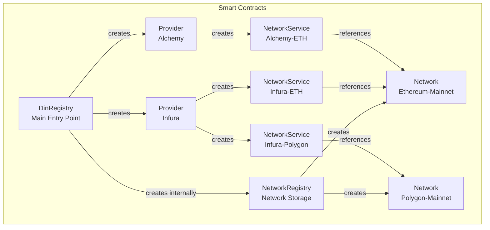
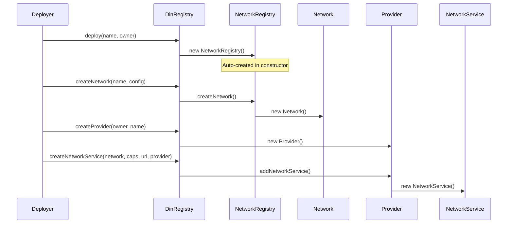
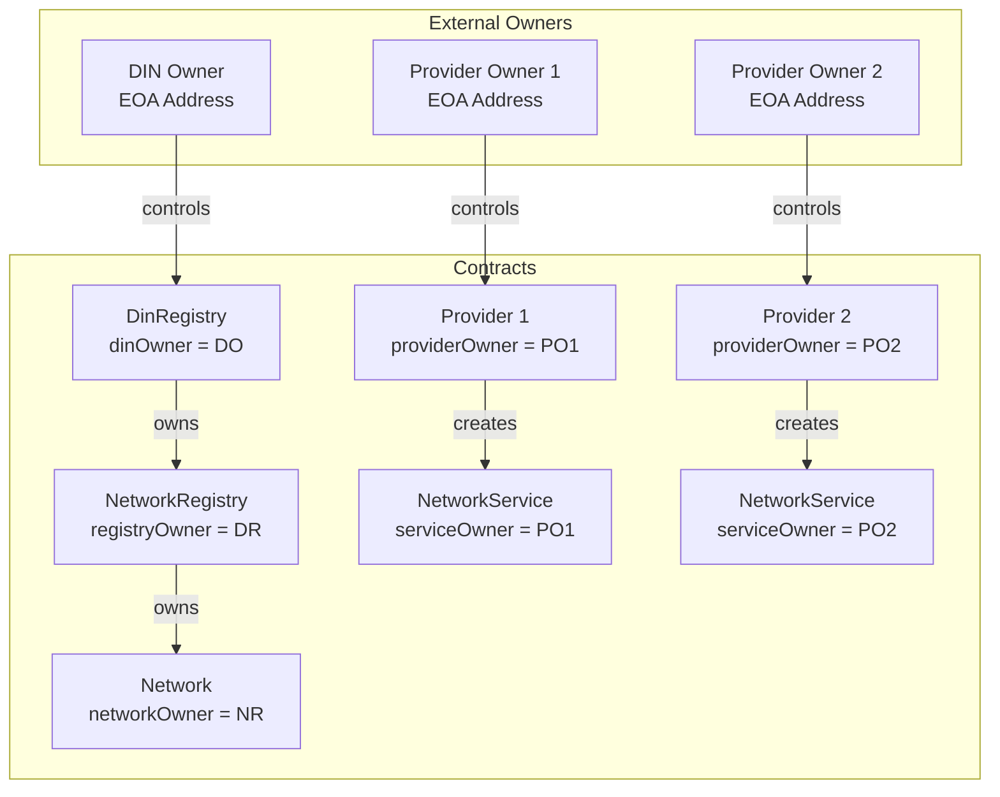
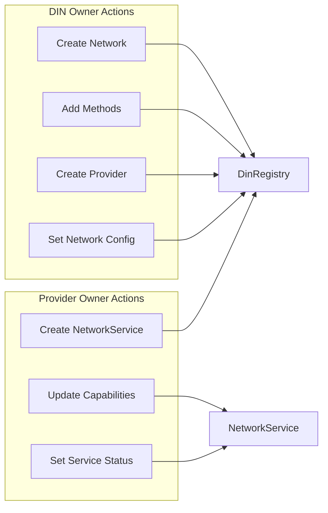
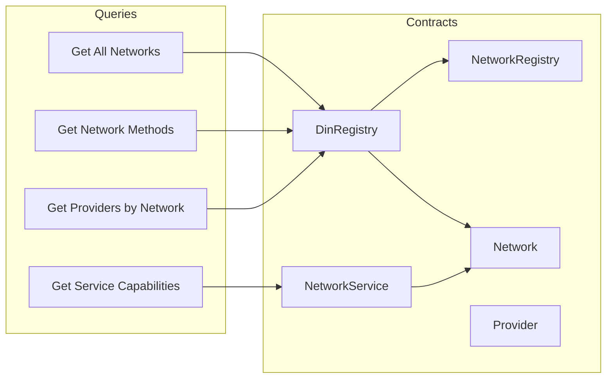
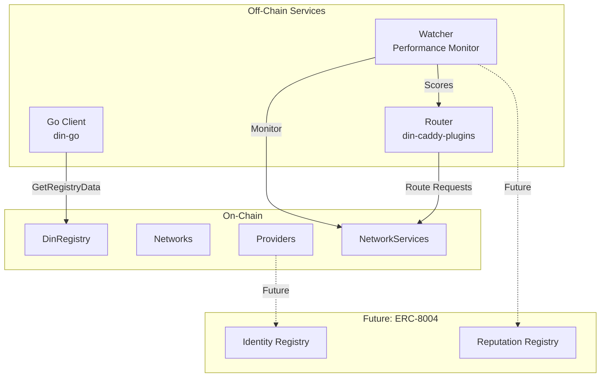

# Architecture Overview

This document describes the DIN Registry system architecture, contract hierarchy, and ownership model.

## System Components



## Contract Hierarchy

### Deployment Order



### Contract Responsibilities

| Contract | Location | Purpose |
|----------|----------|---------|
| **DinRegistry** | `src/DinRegistry.sol` | Central hub - main entry point for all operations |
| **NetworkRegistry** | `src/NetworkRegistry.sol` | Internal registry for Network contracts |
| **Network** | `src/Network.sol` | Represents a blockchain protocol with RPC methods |
| **Provider** | `src/Provider.sol` | Represents an RPC service provider |
| **NetworkService** | `src/NetworkService.sol` | Links a Provider to a Network with capabilities |
| **INetwork** | `src/INetwork.sol` | Interface and shared type definitions |

## Ownership Model



### Ownership Rules

| Contract | Owner Set By | Immutable? | Can Transfer? |
|----------|--------------|------------|---------------|
| DinRegistry | Constructor parameter | Yes | No |
| NetworkRegistry | DinRegistry address | Yes | No |
| Network | NetworkRegistry.registryOwner | Yes | No |
| Provider | Constructor parameter (EOA) | Yes | No |
| NetworkService | Provider.providerOwner | Yes | No |

## Data Flow

### Write Operations



### Read Operations



## Storage Architecture

### DinRegistry Storage

```
┌─────────────────────────────────────────────────────────────┐
│                      DinRegistry                             │
├─────────────────────────────────────────────────────────────┤
│ IMMUTABLE:                                                   │
│   address dinOwner                                           │
│   NetworkRegistry s_networkRegistry                          │
├─────────────────────────────────────────────────────────────┤
│ ARRAYS:                                                      │
│   INetwork[] networks          ─── All network addresses     │
│   Provider[] providers         ─── All provider addresses    │
├─────────────────────────────────────────────────────────────┤
│ MAPPINGS:                                                    │
│   string => bool networkMap           ─── Network exists?    │
│   Provider => bool providerMap        ─── Provider exists?   │
│   INetwork => Provider[] network2providers ─── N:M relation  │
│   bytes32 => bool providerNetworkMap  ─── Link exists?       │
└─────────────────────────────────────────────────────────────┘
```

### Network Storage

```
┌─────────────────────────────────────────────────────────────┐
│                        Network                               │
├─────────────────────────────────────────────────────────────┤
│ IMMUTABLE:                                                   │
│   address networkOwner                                       │
├─────────────────────────────────────────────────────────────┤
│ STATE:                                                       │
│   string networkName                                         │
│   string networkDescription                                  │
│   NetworkStatus networkStatus                                │
│   NetworkOperationsConfig opsConfig                          │
│   uint256 capabilities        ─── Bitmask of methods         │
│   uint8 s_nextBit            ─── Next bit to assign (1-255)  │
├─────────────────────────────────────────────────────────────┤
│ ARRAYS:                                                      │
│   Method[] methods            ─── All method structs         │
├─────────────────────────────────────────────────────────────┤
│ MAPPINGS:                                                    │
│   address => bool authenticated   ─── Can add methods?       │
│   string => Method s_name2method  ─── Name lookup            │
│   uint8 => Method s_bit2method    ─── Bit lookup             │
└─────────────────────────────────────────────────────────────┘
```

## Integration Points



## Key Design Decisions

### 1. Contract-per-Entity Model
Each Provider and NetworkService is a separate contract, enabling:
- Independent ownership and permissions
- Clear state isolation
- Direct interaction without proxy

**Trade-off**: Higher deployment gas costs (~500K-800K gas per entity)

### 2. Bitmask Capabilities
Methods encoded as bits (1-255) in a `uint256`:
- O(1) capability checking
- Compact storage
- Efficient bitwise operations

**Trade-off**: Limited to 255 methods per network

### 3. Immutable Ownership
All owner addresses are `immutable`:
- Prevents ownership hijacking
- Clear trust model
- No admin key risks

**Trade-off**: Cannot transfer ownership or recover from key loss

### 4. No Upgradability
Contracts are not upgradeable:
- Simpler security model
- No proxy complexity
- Immutable guarantees

**Trade-off**: Bug fixes require migration to new contracts

## File Locations

| Component | Path |
|-----------|------|
| Smart Contracts | `apps/din-sc/src/` |
| Deployment Scripts | `apps/din-sc/script/` |
| Contract Tests | `apps/din-sc/test/` |
| Go Client | `apps/din-go/lib/din/` |
| Go Handlers | `apps/din-go/pkg/dinregistry/` |
