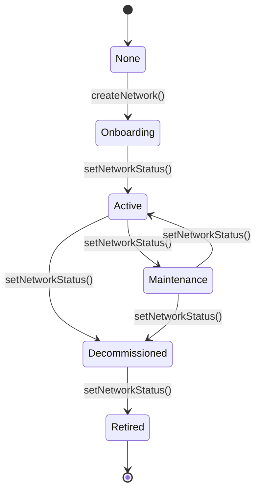
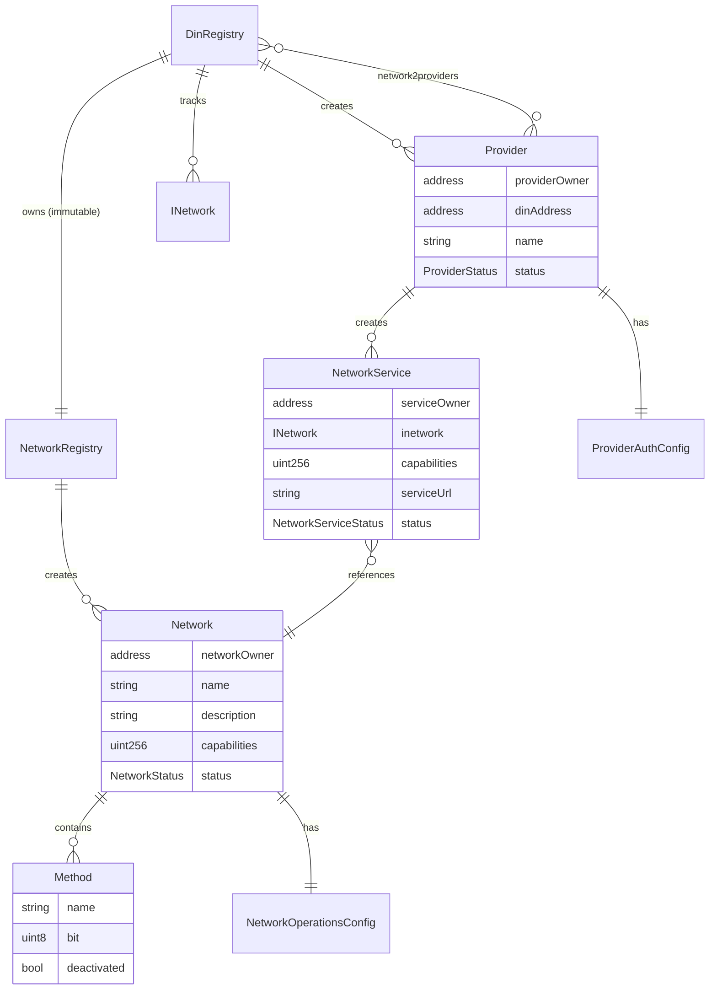
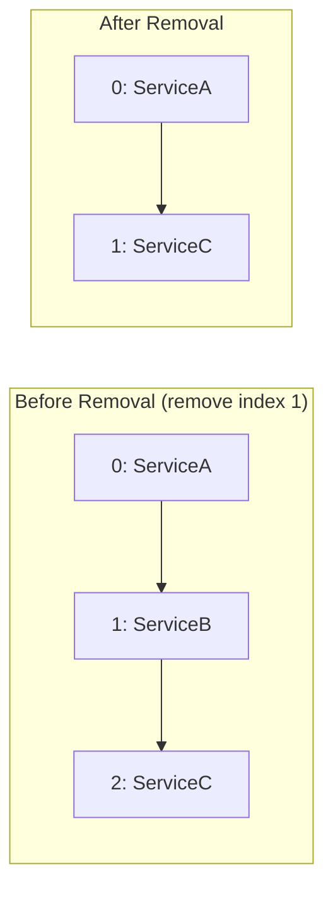
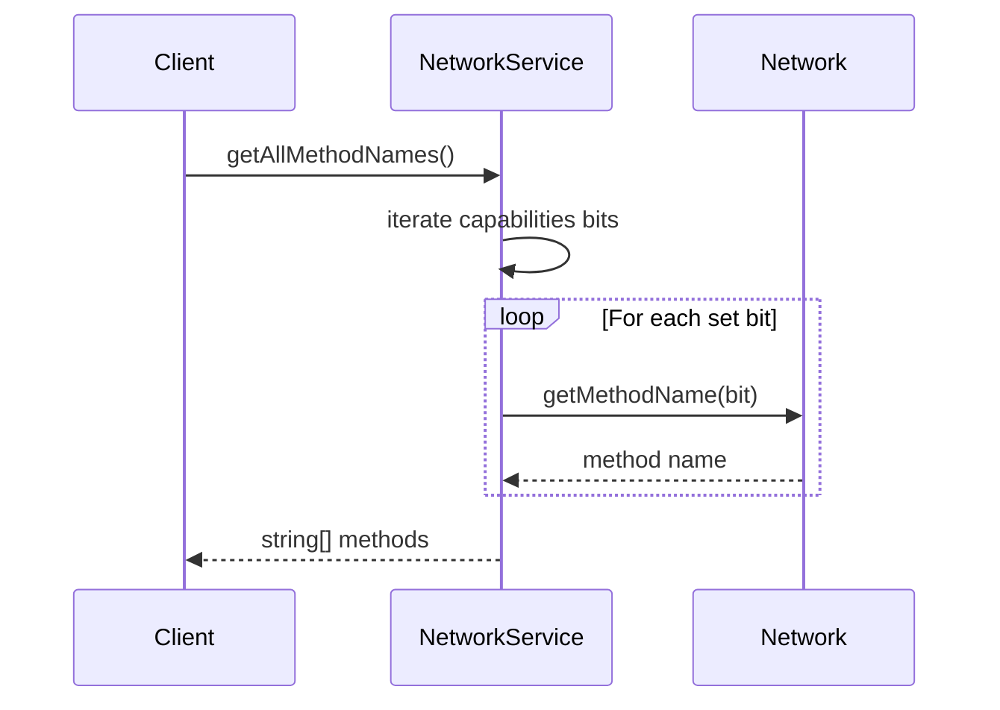
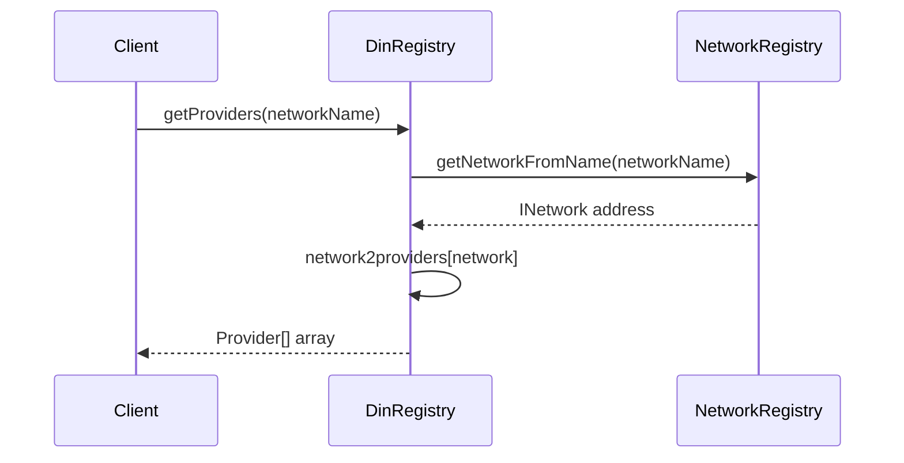

# Data Model

This document describes all data structures, relationships, and validation rules in the DIN Registry.

## Structs

### Method

Represents an RPC method within a network.

```solidity
struct Method {
    string name;        // Method name (e.g., "eth_blockNumber")
    uint8 bit;          // Unique bit position (1-255)
    bool deactivated;   // Soft-delete flag
}
```

| Field | Type | Description |
|-------|------|-------------|
| `name` | `string` | RPC method identifier |
| `bit` | `uint8` | Position in capabilities bitmask (1-255) |
| `deactivated` | `bool` | `true` if method has been removed |

**Constraints**:
- Bit must be unique within a network
- Bit 0 is unused (reserved)
- Maximum 255 methods per network

### NetworkOperationsConfig

Configuration for network operations and health monitoring.

```solidity
struct NetworkOperationsConfig {
    uint8 healthcheckMethodBit;      // Method used for health checks
    uint8 healthcheckIntervalSec;    // Check interval (max 255 sec)
    uint8 blockLagLimit;             // Maximum acceptable block lag
    uint8 requestAttemptCount;       // Retry count for failed requests
    uint16 maxRequestPayloadSizeKb;  // Max request size in KB
    uint32 registryBlockEpoch;       // Block epoch for registry sync
}
```

| Field | Type | Range | Description |
|-------|------|-------|-------------|
| `healthcheckMethodBit` | `uint8` | 1-255 | Must be a valid method bit |
| `healthcheckIntervalSec` | `uint8` | 0-255 | Health check frequency |
| `blockLagLimit` | `uint8` | 0-255 | Blocks behind tolerance |
| `requestAttemptCount` | `uint8` | 0-255 | Max retries |
| `maxRequestPayloadSizeKb` | `uint16` | 0-65535 | Max ~64MB |
| `registryBlockEpoch` | `uint32` | 0-4B | Sync coordination |

### ProviderAuthConfig

Authentication configuration for a provider.

```solidity
struct ProviderAuthConfig {
    ProviderAuthType auth;  // Authentication type
    string url;             // Auth service URL
}
```

| Field | Type | Description |
|-------|------|-------------|
| `auth` | `ProviderAuthType` | `None` or `Siwe` |
| `url` | `string` | Authentication endpoint (empty if `None`) |

### NetworkServiceItem

Internal struct for tracking service positions in Provider.

```solidity
struct NetworkServiceItem {
    uint256 pos;            // Position in services array
    NetworkService managed; // Service contract reference
}
```

Used to enable O(1) removal via swap-and-pop pattern.

### NetworkRegistryEntry

Internal struct for NetworkRegistry.

```solidity
struct NetworkRegistryEntry {
    uint256 id;        // Unique network ID (1, 2, 3...)
    Network network;   // Network contract address
}
```

## Enums

### NetworkStatus

Lifecycle states for a network.

```solidity
enum NetworkStatus {
    None,           // 0 - Uninitialized
    Onboarding,     // 1 - Being set up
    Active,         // 2 - Operational
    Maintenance,    // 3 - Temporarily unavailable
    Decommissioned, // 4 - Being phased out
    Retired         // 5 - No longer available
}
```



### NetworkServiceStatus

Lifecycle states for a network service.

```solidity
enum NetworkServiceStatus {
    None,        // 0 - Uninitialized
    Onboarding,  // 1 - Being set up
    Active,      // 2 - Operational
    Maintenance, // 3 - Temporarily unavailable
    Retired      // 4 - No longer available
}
```

### ProviderStatus

Lifecycle states for a provider.

```solidity
enum ProviderStatus {
    None,        // 0 - Uninitialized
    Onboarding,  // 1 - Being set up
    Active,      // 2 - Operational
    Maintenance, // 3 - Temporarily unavailable
    Retired      // 4 - No longer available
}
```

### ProviderAuthType

Authentication methods supported by providers.

```solidity
enum ProviderAuthType {
    None,  // 0 - No authentication required
    Siwe   // 1 - Sign-In with Ethereum
}
```

## Entity Relationships



## Capability Bitmask System

Methods are encoded as bits in a `uint256` for efficient storage and querying.

### Bit Assignment

```
Method 1: "eth_blockNumber"    → bit 1  → 0b00000010 (2)
Method 2: "eth_getBalance"     → bit 2  → 0b00000100 (4)
Method 3: "eth_getBlockByNum"  → bit 3  → 0b00001000 (8)
...
Method N: "eth_call"           → bit N  → 2^N
```

### Combined Capabilities

```
Network capabilities = Method1 | Method2 | Method3
                     = 2 | 4 | 8
                     = 0b00001110 (14)
```

### Subset Validation

Service capabilities must be a subset of network capabilities:

```solidity
// Service wants to support methods 1 and 2
uint256 serviceCaps = 0b00000110; // 6

// Network supports methods 1, 2, 3
uint256 networkCaps = 0b00001110; // 14

// Validation: (serviceCaps & networkCaps) == serviceCaps
// (6 & 14) == 6 ✓
```

### Capability Checking

```solidity
// Check if service supports method bit 2
bool supported = (service.capabilities & (1 << 2)) > 0;

// Check if service supports multiple methods
uint256 required = (1 << 1) | (1 << 3); // Methods 1 and 3
bool allSupported = (service.capabilities & required) == required;
```

## Storage Patterns

### Dual Indexing (NetworkRegistry)

Networks are indexed by both name and ID:

```solidity
mapping(string => NetworkRegistryEntry) internal s_name2network;
mapping(uint256 => NetworkRegistryEntry) internal s_id2network;
```

Benefits:
- O(1) lookup by name for human-friendly queries
- O(1) lookup by ID for machine-efficient queries
- Both point to the same `NetworkRegistryEntry`

### Swap-and-Pop Deletion (Provider)

Services are stored in an array with position tracking:

```solidity
NetworkService[] public services;
mapping(INetwork => NetworkServiceItem) public serviceMap;
```

Deletion algorithm:
1. Get position of service to remove
2. Copy last service to that position
3. Update position mapping for moved service
4. Pop the array



### Provider-Network Mapping (DinRegistry)

Many-to-many relationship tracked with:

```solidity
mapping(INetwork => Provider[]) public network2providers;
mapping(bytes32 => bool) public providerNetworkMap;
```

The `providerNetworkMap` uses a hash key:

```solidity
bytes32 key = keccak256(abi.encodePacked(address(provider), "::", address(network)));
```

## Validation Rules

| Rule | Location | Description |
|------|----------|-------------|
| Unique network name | DinRegistry | `networkMap[name]` must be false |
| Valid method bit | Network | `s_nextBit` auto-increments (1-255) |
| Capability subset | NetworkService | `caps & networkCaps == caps` |
| Network has methods | NetworkService | `network.getCapabilities() > 0` |
| Provider registered | DinRegistry | `providerMap[provider] == true` |
| Network registered | DinRegistry | `networkMap[name] == true` |
| Valid healthcheck | Network | `isMethodSupported(config.healthcheckMethodBit)` |

## Cross-Contract Data Access

### Reading Methods from Service



### Finding Providers for Network



## Gas Considerations

| Operation | Approximate Gas | Notes |
|-----------|-----------------|-------|
| Create Network | ~1,000,000 | Deploys Network contract |
| Create Provider | ~500,000 | Deploys Provider contract |
| Create NetworkService | ~800,000 | Deploys NetworkService contract |
| Add Method | ~100,000 | Storage writes + event |
| Add 10 Methods | ~400,000 | Batch is more efficient |
| Update Capabilities | ~50,000 | Single storage write |
| Get All Providers | O(n) read | Unbounded array return |
