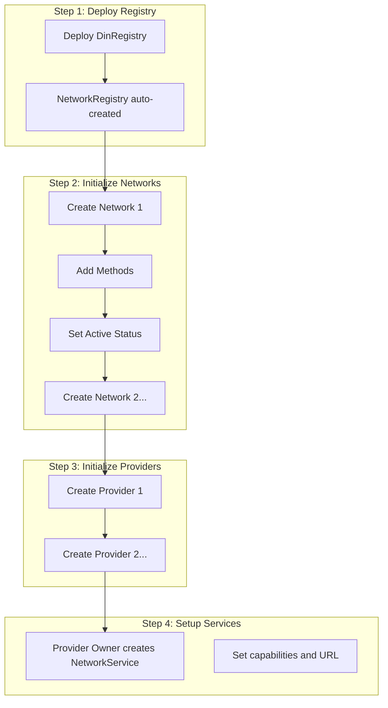

# Deployment Guide

Step-by-step instructions for deploying and initializing the DIN Registry.

## Prerequisites

- [Foundry](https://book.getfoundry.sh/getting-started/installation) installed
- Access to an Ethereum RPC endpoint
- EOA with sufficient ETH for gas
- Private key or hardware wallet for signing

## Deployment Architecture



## Step 1: Deploy DinRegistry

### Using Foundry Script

The main deployment script is at `apps/din-sc/script/DinRegistry.s.sol`:

```solidity
contract DinRegistryScript is Script {
    function run(address dinOwner) external returns (DinRegistry) {
        vm.startBroadcast(dinOwner);
        DinRegistry din = new DinRegistry("DINYZ", dinOwner);
        console2.log("DinRegistry deployed @", address(din));
        vm.stopBroadcast();
        return din;
    }
}
```

### Deploy Command

```bash
# Set environment variables
export DIN_OWNER_ACCOUNT=0xYourOwnerAddress
export RPC_URL=https://your-rpc-endpoint.com
export PRIVATE_KEY=0xYourPrivateKey  # Or use hardware wallet

# Deploy
forge script script/DinRegistry.s.sol:DinRegistryScript \
  --rpc-url $RPC_URL \
  --broadcast \
  --verify \
  --private-key $PRIVATE_KEY

# Or with hardware wallet (Ledger)
forge script script/DinRegistry.s.sol:DinRegistryScript \
  --rpc-url $RPC_URL \
  --broadcast \
  --verify \
  --ledger
```

### Expected Output

```
== Logs ==
DinRegistry deployed @ 0x1234567890abcdef...
```

Save this address - it's needed for all subsequent operations.

## Step 2: Initialize Networks

### Create Network Script

Create `apps/din-sc/script/AllNetworks.s.sol`:

```solidity
// SPDX-License-Identifier: MIT
pragma solidity 0.8.27;

import "../src/DinRegistry.sol";
import {Script, console2} from "forge-std/Script.sol";

contract DeployNetworks is Script {
    function run(address dinOwner, DinRegistry dinRegistry) external {
        vm.startBroadcast(dinOwner);

        // ==========================================
        // Ethereum Mainnet
        // ==========================================
        NetworkOperationsConfig memory ethConfig = NetworkOperationsConfig({
            healthcheckMethodBit: 1,       // eth_blockNumber
            healthcheckIntervalSec: 30,
            blockLagLimit: 5,
            requestAttemptCount: 3,
            maxRequestPayloadSizeKb: 256,
            registryBlockEpoch: 0
        });

        INetwork ethMainnet = dinRegistry.createNetwork(
            "Ethereum-Mainnet",
            "Ethereum Mainnet JSON-RPC",
            ethConfig,
            NetworkStatus.Onboarding
        );
        console2.log("Created Ethereum-Mainnet @", address(ethMainnet));

        // Add methods (order matters - determines bit positions)
        string[] memory ethMethods = new string[](15);
        ethMethods[0] = "eth_blockNumber";           // bit 1 (healthcheck)
        ethMethods[1] = "eth_getBalance";            // bit 2
        ethMethods[2] = "eth_getBlockByNumber";      // bit 3
        ethMethods[3] = "eth_getBlockByHash";        // bit 4
        ethMethods[4] = "eth_call";                  // bit 5
        ethMethods[5] = "eth_sendRawTransaction";    // bit 6
        ethMethods[6] = "eth_getTransactionReceipt"; // bit 7
        ethMethods[7] = "eth_gasPrice";              // bit 8
        ethMethods[8] = "eth_chainId";               // bit 9
        ethMethods[9] = "eth_getCode";               // bit 10
        ethMethods[10] = "eth_getLogs";              // bit 11
        ethMethods[11] = "eth_estimateGas";          // bit 12
        ethMethods[12] = "eth_getTransactionByHash"; // bit 13
        ethMethods[13] = "eth_getTransactionCount";  // bit 14
        ethMethods[14] = "eth_feeHistory";           // bit 15

        uint256 caps = dinRegistry.addMethodsToNetwork("Ethereum-Mainnet", ethMethods);
        console2.log("Ethereum-Mainnet capabilities:", caps);

        // Activate network
        dinRegistry.setNetworkStatus("Ethereum-Mainnet", NetworkStatus.Active);

        // ==========================================
        // Polygon Mainnet
        // ==========================================
        NetworkOperationsConfig memory polygonConfig = NetworkOperationsConfig({
            healthcheckMethodBit: 1,
            healthcheckIntervalSec: 15,    // Faster for Polygon
            blockLagLimit: 10,
            requestAttemptCount: 3,
            maxRequestPayloadSizeKb: 256,
            registryBlockEpoch: 0
        });

        INetwork polygonMainnet = dinRegistry.createNetwork(
            "Polygon-Mainnet",
            "Polygon PoS Mainnet JSON-RPC",
            polygonConfig,
            NetworkStatus.Onboarding
        );

        dinRegistry.addMethodsToNetwork("Polygon-Mainnet", ethMethods);
        dinRegistry.setNetworkStatus("Polygon-Mainnet", NetworkStatus.Active);

        console2.log("Created Polygon-Mainnet @", address(polygonMainnet));

        vm.stopBroadcast();
    }
}
```

## Step 3: Initialize Providers

### Create Provider Script

Create `apps/din-sc/script/AllProviders.s.sol`:

```solidity
// SPDX-License-Identifier: MIT
pragma solidity 0.8.27;

import "../src/DinRegistry.sol";
import {Script, console2} from "forge-std/Script.sol";

contract DeployProviders is Script {
    function run(address dinOwner, DinRegistry dinRegistry) external {
        vm.startBroadcast(dinOwner);

        // ==========================================
        // Provider 1: No Auth
        // ==========================================
        address provider1Owner = 0x1111111111111111111111111111111111111111;

        ProviderAuthConfig memory noAuthConfig = ProviderAuthConfig({
            auth: ProviderAuthType.None,
            url: ""
        });

        Provider provider1 = dinRegistry.createProvider(
            provider1Owner,
            "PublicProvider",
            noAuthConfig,
            ProviderStatus.Onboarding
        );
        console2.log("Created PublicProvider @", address(provider1));

        // ==========================================
        // Provider 2: SIWE Auth
        // ==========================================
        address provider2Owner = 0x2222222222222222222222222222222222222222;

        ProviderAuthConfig memory siweConfig = ProviderAuthConfig({
            auth: ProviderAuthType.Siwe,
            url: "https://auth.provider2.example.com/siwe"
        });

        Provider provider2 = dinRegistry.createProvider(
            provider2Owner,
            "AuthenticatedProvider",
            siweConfig,
            ProviderStatus.Onboarding
        );
        console2.log("Created AuthenticatedProvider @", address(provider2));

        vm.stopBroadcast();
    }
}
```

## Step 4: Provider Creates Services

This step is performed by **Provider Owners**, not the DIN Owner.

### Service Setup Script

```solidity
// SPDX-License-Identifier: MIT
pragma solidity 0.8.27;

import "../src/DinRegistry.sol";
import {Script, console2} from "forge-std/Script.sol";

contract ProviderSetup is Script {
    function run(
        address providerOwner,
        DinRegistry dinRegistry,
        Provider provider
    ) external {
        vm.startBroadcast(providerOwner);

        // Get network capabilities
        uint256 ethCaps = dinRegistry.getNetworkCapabilities("Ethereum-Mainnet");
        console2.log("Ethereum-Mainnet capabilities:", ethCaps);

        // Support all methods
        NetworkService ethService = dinRegistry.createNetworkService(
            "Ethereum-Mainnet",
            ethCaps,
            "https://my-provider.example.com/eth/mainnet",
            NetworkServiceStatus.Active,
            provider
        );
        console2.log("Created ETH service @", address(ethService));

        // Support only read methods on Polygon (bits 1-5, 7-15)
        // Excluding bit 6 (eth_sendRawTransaction)
        uint256 readOnlyCaps = ethCaps & ~(1 << 6);
        NetworkService polygonService = dinRegistry.createNetworkService(
            "Polygon-Mainnet",
            readOnlyCaps,
            "https://my-provider.example.com/polygon/mainnet",
            NetworkServiceStatus.Active,
            provider
        );
        console2.log("Created Polygon service @", address(polygonService));

        vm.stopBroadcast();
    }
}
```

## Full Deployment Script

The orchestrator script at `apps/din-sc/script/Deploy.s.sol`:

```solidity
// SPDX-License-Identifier: MIT
pragma solidity 0.8.27;

import "../src/DinRegistry.sol";
import {Script, console2} from "forge-std/Script.sol";

import "./AllNetworks.s.sol";
import "./AllProviders.s.sol";
import "./DinRegistry.s.sol";

contract Deploy is Script {
    address dinOwner = vm.envAddress("DIN_OWNER_ACCOUNT");

    function run() external {
        // Step 1: Deploy DinRegistry
        DinRegistryScript din = new DinRegistryScript();
        DinRegistry dinRegistry = din.run(dinOwner);

        // Step 2: Initialize Networks
        DeployNetworks networks = new DeployNetworks();
        networks.run(dinOwner, dinRegistry);

        // Step 3: Initialize Providers
        DeployProviders providers = new DeployProviders();
        providers.run(dinOwner, dinRegistry);

        console2.log("=== Deployment Complete ===");
        console2.log("DinRegistry:", address(dinRegistry));
    }
}
```

### Run Full Deployment

```bash
export DIN_OWNER_ACCOUNT=0xYourOwnerAddress
export RPC_URL=https://your-rpc-endpoint.com

forge script script/Deploy.s.sol:Deploy \
  --rpc-url $RPC_URL \
  --broadcast \
  --verify \
  --private-key $PRIVATE_KEY
```

## Local Development (Anvil)

### Start Local Node

```bash
anvil
```

### Deploy to Local

```bash
export DIN_OWNER_ACCOUNT=0xf39Fd6e51aad88F6F4ce6aB8827279cffFb92266  # Anvil account 0
export RPC_URL=http://127.0.0.1:8545

forge script script/Deploy.s.sol:Deploy \
  --rpc-url $RPC_URL \
  --broadcast \
  --private-key 0xac0974bec39a17e36ba4a6b4d238ff944bacb478cbed5efcae784d7bf4f2ff80
```

## Post-Deployment Verification

### Verify Contracts on Etherscan

```bash
forge verify-contract \
  --chain-id 1 \
  --num-of-optimizations 200 \
  --watch \
  --constructor-args $(cast abi-encode "constructor(string,address)" "DINYZ" $DIN_OWNER_ACCOUNT) \
  $DINREGISTRY_ADDRESS \
  src/DinRegistry.sol:DinRegistry
```

### Query Deployed State

```bash
# Get all networks
cast call $DINREGISTRY_ADDRESS "getAllNetworks()" --rpc-url $RPC_URL

# Get network capabilities
cast call $DINREGISTRY_ADDRESS "getNetworkCapabilities(string)" "Ethereum-Mainnet" --rpc-url $RPC_URL

# Get all providers
cast call $DINREGISTRY_ADDRESS "getAllProviders()" --rpc-url $RPC_URL
```

## Deployment Checklist

- [ ] Foundry installed and configured
- [ ] RPC endpoint accessible
- [ ] Deployer wallet funded
- [ ] Environment variables set
- [ ] DinRegistry deployed
- [ ] Networks created with methods
- [ ] Networks set to Active
- [ ] Providers created
- [ ] Provider owners notified
- [ ] Contracts verified on block explorer
- [ ] Go client tested against deployment

## Troubleshooting

### "NetworkExists" Error
Network name already registered. Use a unique name.

### "AuthRequireDINOwner" Error
Transaction sender is not the DIN owner. Check `DIN_OWNER_ACCOUNT`.

### "CapabilitiesNotSupported" Error
Service capabilities include methods not in the network. Ensure `caps & networkCaps == caps`.

### Out of Gas
Increase gas limit: `--gas-limit 5000000`

### Nonce Issues
Reset nonce: `--nonce <correct_nonce>` or wait for pending transactions.
