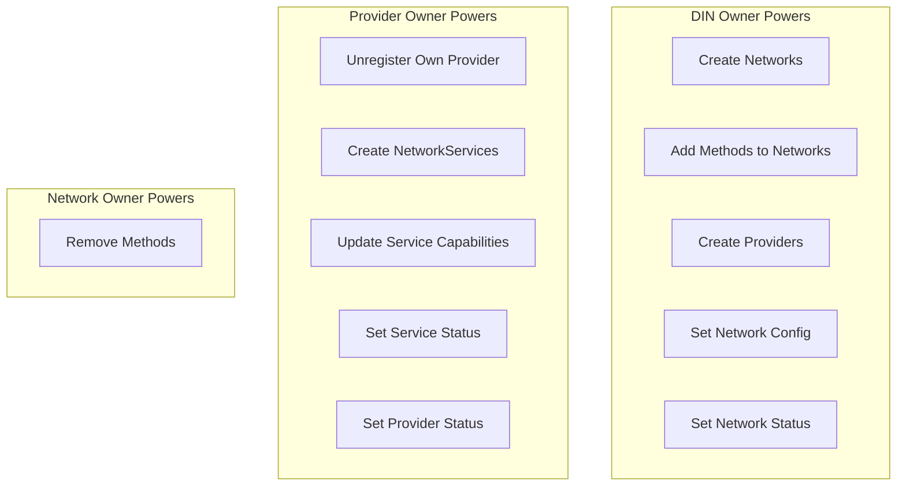
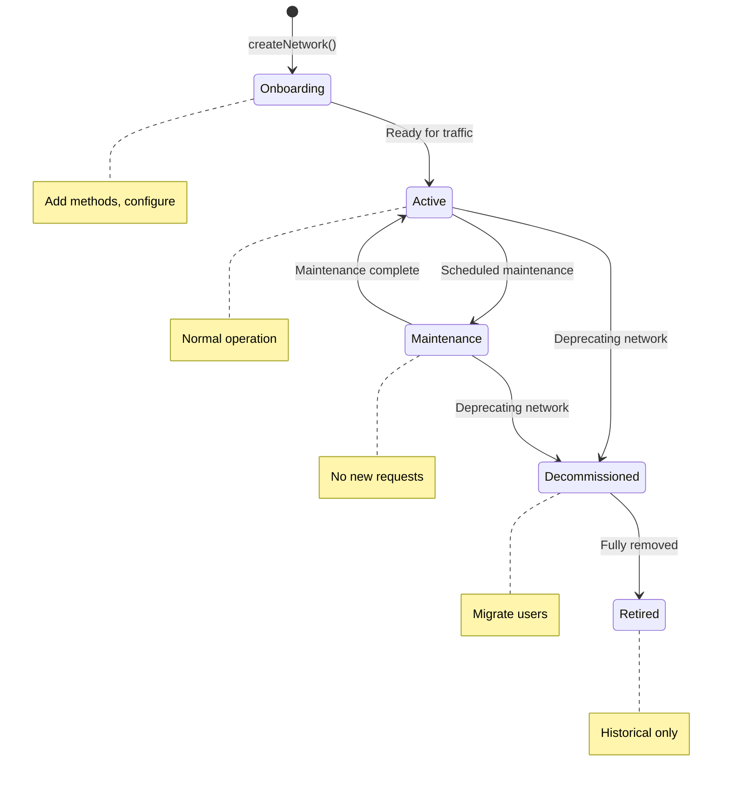

# Admin Operations

This document covers access control, maintenance operations, and lifecycle management for the DIN Registry.

## Access Control Matrix



### Permission Table

| Operation | DIN Owner | Provider Owner | Network Owner | Anyone |
|-----------|:---------:|:--------------:|:-------------:|:------:|
| `createNetwork()` | ✓ | | | |
| `addMethodToNetwork()` | ✓ | | | |
| `addMethodsToNetwork()` | ✓ | | | |
| `setNetworkStatus()` | ✓ | | | |
| `setNetworkOperationsConfig()` | ✓ | | | |
| `createProvider()` | ✓ | | | |
| `unregisterProvider()` | | ✓* | | |
| `createNetworkService()` | | ✓* | | |
| `removeMethod()` | | | ✓ | |
| `setCapabilities()` (service) | | ✓** | | |
| `setStatus()` (service) | | ✓** | | |
| `setProviderStatus()` | | ✓* | | |
| All view functions | ✓ | ✓ | ✓ | ✓ |

\* For their own Provider only
\** Service owner (same as Provider owner)

## Network Management

### Creating a Network

```solidity
// Only DIN Owner
NetworkOperationsConfig memory config = NetworkOperationsConfig({
    healthcheckMethodBit: 1,
    healthcheckIntervalSec: 30,
    blockLagLimit: 5,
    requestAttemptCount: 3,
    maxRequestPayloadSizeKb: 256,
    registryBlockEpoch: 0
});

INetwork network = dinRegistry.createNetwork(
    "Arbitrum-One",
    "Arbitrum One L2 JSON-RPC",
    config,
    NetworkStatus.Onboarding
);
```

### Adding Methods

```solidity
// Single method
uint8 bit = dinRegistry.addMethodToNetwork("Arbitrum-One", "eth_blockNumber");

// Multiple methods (more gas efficient)
string[] memory methods = new string[](3);
methods[0] = "eth_getBalance";
methods[1] = "eth_call";
methods[2] = "eth_sendRawTransaction";

uint256 caps = dinRegistry.addMethodsToNetwork("Arbitrum-One", methods);
```

### Updating Network Configuration

```solidity
NetworkOperationsConfig memory newConfig = NetworkOperationsConfig({
    healthcheckMethodBit: 1,
    healthcheckIntervalSec: 60,      // Increased from 30
    blockLagLimit: 10,               // Increased from 5
    requestAttemptCount: 5,          // Increased from 3
    maxRequestPayloadSizeKb: 512,    // Increased from 256
    registryBlockEpoch: block.number // Updated epoch
});

dinRegistry.setNetworkOperationsConfig("Arbitrum-One", newConfig);
```

### Network Status Lifecycle



```solidity
// Activate after setup
dinRegistry.setNetworkStatus("Arbitrum-One", NetworkStatus.Active);

// Maintenance mode
dinRegistry.setNetworkStatus("Arbitrum-One", NetworkStatus.Maintenance);

// Resume operations
dinRegistry.setNetworkStatus("Arbitrum-One", NetworkStatus.Active);

// Begin deprecation
dinRegistry.setNetworkStatus("Arbitrum-One", NetworkStatus.Decommissioned);

// Final retirement
dinRegistry.setNetworkStatus("Arbitrum-One", NetworkStatus.Retired);
```

## Provider Management

### Creating a Provider

```solidity
// DIN Owner creates provider with designated owner EOA
ProviderAuthConfig memory authConfig = ProviderAuthConfig({
    auth: ProviderAuthType.Siwe,
    url: "https://auth.newprovider.com/siwe"
});

Provider provider = dinRegistry.createProvider(
    0xProviderOwnerEOA,
    "NewProvider",
    authConfig,
    ProviderStatus.Onboarding
);
```

### Provider Unregistration

```solidity
// Provider Owner calls this for their own provider
dinRegistry.unregisterProvider(provider);
```

**Note**: Current implementation has a TODO - provider-network mappings cleanup is incomplete.

### Provider Status Lifecycle

```solidity
// Provider owner activates their provider
provider.setProviderStatus(ProviderStatus.Active);

// Maintenance mode
provider.setProviderStatus(ProviderStatus.Maintenance);

// Retire provider
provider.setProviderStatus(ProviderStatus.Retired);
```

## Service Management

### Creating a NetworkService

```solidity
// Provider Owner creates service
uint256 networkCaps = dinRegistry.getNetworkCapabilities("Ethereum-Mainnet");

// Support all methods
NetworkService service = dinRegistry.createNetworkService(
    "Ethereum-Mainnet",
    networkCaps,
    "https://provider.example.com/eth",
    NetworkServiceStatus.Active,
    provider
);

// Or support subset (read-only, no sendRawTransaction)
uint256 readOnlyCaps = networkCaps & ~(1 << 6);  // Remove bit 6
NetworkService readOnlyService = dinRegistry.createNetworkService(
    "Ethereum-Mainnet",
    readOnlyCaps,
    "https://provider.example.com/eth/readonly",
    NetworkServiceStatus.Active,
    provider
);
```

### Updating Service Capabilities

```solidity
// Service owner (Provider owner) updates capabilities
// Must still be subset of network capabilities
uint256 newCaps = dinRegistry.getNetworkCapabilities("Ethereum-Mainnet");
service.setCapabilities(newCaps);
```

### Service Status Management

```solidity
// Activate
service.setStatus(NetworkServiceStatus.Active);

// Maintenance
service.setStatus(NetworkServiceStatus.Maintenance);

// Retire
service.setStatus(NetworkServiceStatus.Retired);
```

### Removing a Service

```solidity
// Provider owner removes service
provider.removeNetworkService(network);
```

## Method Management

### Removing a Method (Soft Delete)

Only Network Owner can remove methods:

```solidity
// By bit position
network.removeMethod(6);  // Remove bit 6

// By name
uint8 removedBit = network.removeMethod("eth_sendRawTransaction");
```

**Important**: Methods are soft-deleted (marked `deactivated`), not physically removed. This preserves historical data and prevents bit reuse.


## Monitoring Operations

### Query All Networks

```solidity
INetwork[] memory networks = dinRegistry.getAllNetworks();
for (uint i = 0; i < networks.length; i++) {
    string memory name = networks[i].getName();
    NetworkStatus status = networks[i].getNetworkStatus();
    uint256 caps = networks[i].getCapabilities();
}
```

### Query Providers for Network

```solidity
Provider[] memory providers = dinRegistry.getProviders("Ethereum-Mainnet");
for (uint i = 0; i < providers.length; i++) {
    string memory name = providers[i].name();
    ProviderStatus status = providers[i].providerStatus();
}
```

### Query Provider Services

```solidity
NetworkService[] memory services = provider.getAllNetworkServices();
for (uint i = 0; i < services.length; i++) {
    string memory url = services[i].serviceUrl();
    uint256 caps = services[i].capabilities();
    NetworkServiceStatus status = services[i].getStatus();
}
```

## Emergency Procedures

### Network Emergency Maintenance

```solidity
// Immediately halt traffic to network
dinRegistry.setNetworkStatus("Ethereum-Mainnet", NetworkStatus.Maintenance);

// Update config if needed
NetworkOperationsConfig memory emergencyConfig = NetworkOperationsConfig({
    healthcheckMethodBit: 1,
    healthcheckIntervalSec: 5,       // More frequent checks
    blockLagLimit: 100,              // Lenient during incident
    requestAttemptCount: 1,          // Fail fast
    maxRequestPayloadSizeKb: 64,     // Reduce load
    registryBlockEpoch: block.number
});
dinRegistry.setNetworkOperationsConfig("Ethereum-Mainnet", emergencyConfig);
```

### Provider Emergency Removal

Currently requires Provider Owner cooperation. DIN Owner cannot forcibly remove providers.

**Workaround**: Set network to Maintenance to stop routing to all providers.

## Operational Best Practices

### Before Adding a Network

1. Document all RPC methods to support
2. Determine healthcheck method
3. Set appropriate limits based on expected traffic
4. Create in `Onboarding` status first
5. Add all methods
6. Test with a single provider
7. Set to `Active` when ready

### Before Adding a Provider

1. Verify provider owner EOA
2. Determine auth requirements
3. Create in `Onboarding` status
4. Provider owner creates services
5. Provider owner sets to `Active`

### Regular Maintenance

| Task | Frequency | Description |
|------|-----------|-------------|
| Review network status | Daily | Check for stuck states |
| Verify provider health | Daily | Cross-reference with watcher |
| Update registry epoch | Weekly | Keep sync markers current |
| Review capabilities | Monthly | Ensure services match networks |
| Audit access | Quarterly | Verify owner addresses |

## Event Monitoring

Key events to monitor:

```solidity
// Network events
event NetworkRegistered(string registryName, Network network);
event NetworkStatusUpdated(Network indexed network, NetworkStatus newStatus);
event NetworkOperationConfigUpdated(Network indexed network, NetworkOperationsConfig newConfig);
event AddMethodToNetwork(Network network, string method, uint8 bit);
event RemoveMethodFromNetwork(Network network, string method, uint8 bit);

// Provider events
event ProviderStatusUpdated(Provider indexed provider, ProviderStatus newStatus);
event AddNetworkServiceToProvider(INetwork indexed network, NetworkService service, uint256 initialCaps, NetworkServiceStatus status);
event RemoveNetworkServiceFromProvider(INetwork indexed network, NetworkService service);

// Service events
event CapabilitiesUpdated(NetworkService service, uint256 capabilities);
event ServiceStatusUpdated(NetworkService service, NetworkServiceStatus status);
```

Example event query (ethers.js):

```javascript
const filter = dinRegistry.filters.NetworkStatusUpdated();
const events = await dinRegistry.queryFilter(filter, fromBlock, toBlock);
```
