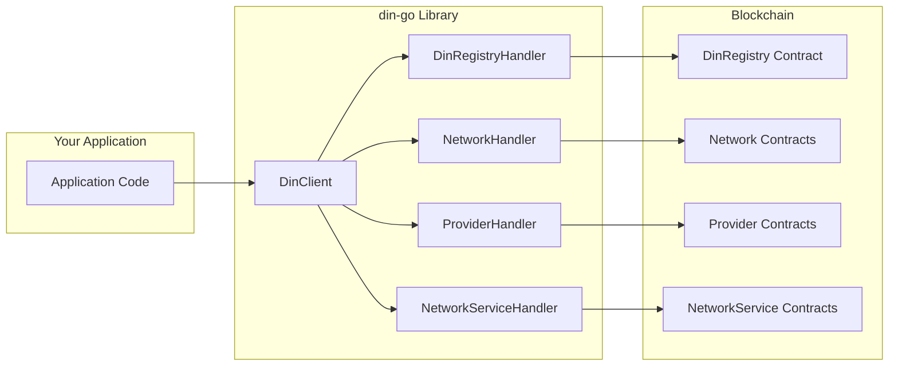
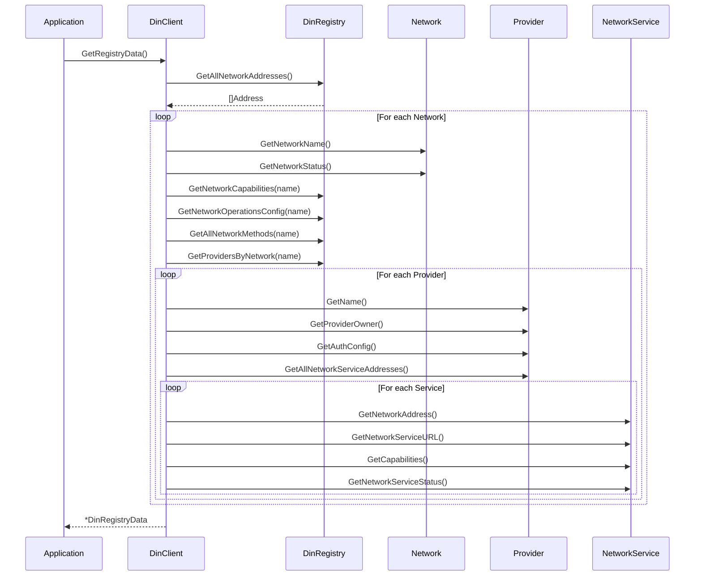

# Client Integration

This document covers integrating with the DIN Registry using the Go client library.

## Overview

The `din-go` library provides a high-level Go client for interacting with the DIN Registry smart contracts. It handles ABI encoding/decoding, contract instantiation, and provides typed responses.



## Installation

```bash
go get github.com/DIN-center/din-sc/apps/din-go
```

## Quick Start

### Initialize the Client

```go
package main

import (
    "log"

    "github.com/DIN-center/din-sc/apps/din-go/lib/din"
    "go.uber.org/zap"
)

func main() {
    logger, _ := zap.NewProduction()

    // Initialize with RPC endpoint and registry contract address
    client, err := din.NewDinClient(
        logger,
        "https://arb-mainnet.g.alchemy.com/v2/YOUR_API_KEY",
        "0xYourRegistryContractAddress",
    )
    if err != nil {
        log.Fatalf("Failed to create client: %v", err)
    }

    // Fetch all registry data
    data, err := client.GetRegistryData()
    if err != nil {
        log.Fatalf("Failed to get registry data: %v", err)
    }

    // Use the data
    for networkName, network := range data.Networks {
        log.Printf("Network: %s, Status: %s", networkName, network.Status)
    }
}
```

## Client Interface

The `IDingoClient` interface defines all available operations:

```go
type IDingoClient interface {
    // GetRegistryData fetches the complete registry state
    GetRegistryData() (*DinRegistryData, error)

    // GetNetworkServiceMethods returns method names for a service
    GetNetworkServiceMethods(networkServiceAddress string) ([]*string, error)

    // GetNetworkMethodNameByBit resolves a method bit to its name
    GetNetworkMethodNameByBit(networkName string, bit uint8) (string, error)

    // GetEthClient returns the underlying JSON-RPC client
    GetEthClient() *jsonrpc.Client

    // GetLatestBlockNumber returns the current block number
    GetLatestBlockNumber() (uint64, error)
}
```

## Data Types

### DinRegistryData

The complete registry state returned by `GetRegistryData()`:

```go
type DinRegistryData struct {
    Networks map[string]*Network  // Keyed by network name
}
```

### Network

Represents a blockchain network:

```go
type Network struct {
    Address       string                        // Contract address
    Status        string                        // "Active", "Maintenance", etc.
    Name          string                        // e.g., "Ethereum-Mainnet"
    ProxyName     string                        // Normalized name for routing
    Methods       map[string]*dinregistry.Method // Supported RPC methods
    Providers     map[string]*Provider          // Providers serving this network
    Capabilities  *big.Int                      // Bitmask of supported methods
    NetworkConfig *dinregistry.NetworkConfig    // Operational configuration
}
```

### Provider

Represents an RPC service provider:

```go
type Provider struct {
    Address         string                                // Contract address
    Name            string                                // e.g., "Alchemy"
    Owner           string                                // Owner EOA address
    NetworkServices map[string]*NetworkService            // Services by URL
    AuthConfig      *dinregistry.NetworkServiceAuthConfig // Auth requirements
}
```

### NetworkService

Links a provider to a network:

```go
type NetworkService struct {
    Address      string    // Contract address
    Status       string    // Service status
    Url          string    // Service endpoint URL
    Capabilities *big.Int  // Supported method bitmask
    Methods      map[string]*dinregistry.Method
}
```

### Method

Represents an RPC method:

```go
type Method struct {
    Name        string `json:"name"`        // e.g., "eth_blockNumber"
    Bit         uint8  `json:"bit"`         // Bit position (1-255)
    Deactivated bool   `json:"deactivated"` // Soft-delete flag
}
```

### NetworkConfig

Operational parameters for a network:

```go
type NetworkConfig struct {
    HealthcheckMethodBit    uint8  // Method bit for health checks
    HealthcheckIntervalSec  uint8  // Health check interval
    BlockLagLimit           uint8  // Max acceptable block lag
    RequestAttemptCount     uint8  // Retry count
    MaxRequestPayloadSizeKb uint16 // Max request size in KB
}
```

### NetworkServiceAuthConfig

Authentication configuration:

```go
type NetworkServiceAuthConfig struct {
    Type string  // "None" or "siwe"
    Url  string  // Auth endpoint URL
}
```

## Common Usage Patterns

### List All Networks

```go
func listNetworks(client din.IDingoClient) error {
    data, err := client.GetRegistryData()
    if err != nil {
        return err
    }

    for name, network := range data.Networks {
        fmt.Printf("Network: %s\n", name)
        fmt.Printf("  Address: %s\n", network.Address)
        fmt.Printf("  Status: %s\n", network.Status)
        fmt.Printf("  Providers: %d\n", len(network.Providers))
        fmt.Printf("  Methods: %d\n", len(network.Methods))
    }
    return nil
}
```

### Find Active Providers for a Network

```go
func getActiveProviders(client din.IDingoClient, networkName string) ([]*din.Provider, error) {
    data, err := client.GetRegistryData()
    if err != nil {
        return nil, err
    }

    network, ok := data.Networks[networkName]
    if !ok {
        return nil, fmt.Errorf("network %s not found", networkName)
    }

    var activeProviders []*din.Provider
    for _, provider := range network.Providers {
        for _, service := range provider.NetworkServices {
            if service.Status == "Active" {
                activeProviders = append(activeProviders, provider)
                break
            }
        }
    }
    return activeProviders, nil
}
```

### Check Method Support

```go
func isMethodSupported(network *din.Network, methodName string) bool {
    method, exists := network.Methods[methodName]
    if !exists {
        return false
    }
    return !method.Deactivated
}

// Check using capabilities bitmask
func isMethodSupportedByBit(capabilities *big.Int, bit uint8) bool {
    mask := new(big.Int).Lsh(big.NewInt(1), uint(bit))
    return new(big.Int).And(capabilities, mask).Cmp(big.NewInt(0)) > 0
}
```

### Get Service Endpoints

```go
func getServiceEndpoints(client din.IDingoClient, networkName string) ([]string, error) {
    data, err := client.GetRegistryData()
    if err != nil {
        return nil, err
    }

    network, ok := data.Networks[networkName]
    if !ok {
        return nil, fmt.Errorf("network %s not found", networkName)
    }

    var endpoints []string
    for _, provider := range network.Providers {
        for url, service := range provider.NetworkServices {
            if service.Status == "Active" {
                endpoints = append(endpoints, url)
            }
        }
    }
    return endpoints, nil
}
```

### Resolve Method Bit to Name

```go
func resolveMethodName(client din.IDingoClient, networkName string, bit uint8) (string, error) {
    return client.GetNetworkMethodNameByBit(networkName, bit)
}
```

## Data Flow



## Low-Level Handlers

For more granular control, you can use the handlers directly from the `dinregistry` package:

### DinRegistryHandler

```go
import din "github.com/DIN-center/din-sc/apps/din-go/pkg/dinregistry"

// Create handler
handler, err := din.NewDinRegistryHandler(ethClient, contractAddress)

// Get all networks
networks, err := handler.GetAllNetworkAddresses()

// Get providers for a network
providers, err := handler.GetProvidersByNetwork("Ethereum-Mainnet")

// Get network capabilities
caps, err := handler.GetNetworkCapabilities("Ethereum-Mainnet")
```

### NetworkHandler

```go
networkHandler, err := din.NewNetworkHandler(ethClient, networkAddress)

// Get network metadata
name, err := networkHandler.GetNetworkName()
status, err := networkHandler.GetNetworkStatus()

// Get method information
methodName, err := networkHandler.GetMethodName(bit)
methodId, err := networkHandler.GetMethodId("eth_blockNumber")
```

### ProviderHandler

```go
providerHandler, err := din.NewProviderHandler(ethClient, providerAddress)

// Get provider info
name, err := providerHandler.GetName()
owner, err := providerHandler.GetProviderOwner()
authConfig, err := providerHandler.GetAuthConfig()

// Get services
services, err := providerHandler.GetAllNetworkServiceAddresses()
```

### NetworkServiceHandler

```go
serviceHandler, err := din.NewNetworkServiceHandler(ethClient, serviceAddress)

// Get service info
url, err := serviceHandler.GetNetworkServiceURL()
caps, err := serviceHandler.GetCapabilities()
status, err := serviceHandler.GetNetworkServiceStatus()
networkAddr, err := serviceHandler.GetNetworkAddress()

// Get supported methods
methods, err := serviceHandler.GetAllMethodNames()
```

## Router Integration Example

Here's how a router might use the registry data:

```go
type Router struct {
    client      din.IDingoClient
    registryData *din.DinRegistryData
    lastRefresh  time.Time
    refreshInterval time.Duration
}

func NewRouter(client din.IDingoClient) *Router {
    return &Router{
        client: client,
        refreshInterval: 5 * time.Minute,
    }
}

func (r *Router) RefreshRegistry() error {
    data, err := r.client.GetRegistryData()
    if err != nil {
        return err
    }
    r.registryData = data
    r.lastRefresh = time.Now()
    return nil
}

func (r *Router) SelectEndpoint(networkName, method string) (string, error) {
    // Check if refresh needed
    if time.Since(r.lastRefresh) > r.refreshInterval {
        if err := r.RefreshRegistry(); err != nil {
            return "", err
        }
    }

    network, ok := r.registryData.Networks[networkName]
    if !ok {
        return "", fmt.Errorf("unknown network: %s", networkName)
    }

    // Check if method is supported
    methodInfo, ok := network.Methods[method]
    if !ok || methodInfo.Deactivated {
        return "", fmt.Errorf("unsupported method: %s", method)
    }

    // Find active endpoint supporting this method
    for _, provider := range network.Providers {
        for url, service := range provider.NetworkServices {
            if service.Status != "Active" {
                continue
            }
            if isMethodSupportedByBit(service.Capabilities, methodInfo.Bit) {
                return url, nil
            }
        }
    }

    return "", fmt.Errorf("no endpoint found for %s on %s", method, networkName)
}
```

## Caching Strategies

### In-Memory Cache

```go
type CachedClient struct {
    client    din.IDingoClient
    cache     *din.DinRegistryData
    cacheTTL  time.Duration
    cacheTime time.Time
    mu        sync.RWMutex
}

func (c *CachedClient) GetRegistryData() (*din.DinRegistryData, error) {
    c.mu.RLock()
    if c.cache != nil && time.Since(c.cacheTime) < c.cacheTTL {
        defer c.mu.RUnlock()
        return c.cache, nil
    }
    c.mu.RUnlock()

    c.mu.Lock()
    defer c.mu.Unlock()

    // Double-check after acquiring write lock
    if c.cache != nil && time.Since(c.cacheTime) < c.cacheTTL {
        return c.cache, nil
    }

    data, err := c.client.GetRegistryData()
    if err != nil {
        return nil, err
    }

    c.cache = data
    c.cacheTime = time.Now()
    return data, nil
}
```

### Block-Based Invalidation

```go
type BlockAwareCache struct {
    client       din.IDingoClient
    cache        *din.DinRegistryData
    cacheBlock   uint64
    blockBuffer  uint64 // Invalidate after N blocks
    mu           sync.RWMutex
}

func (c *BlockAwareCache) GetRegistryData() (*din.DinRegistryData, error) {
    currentBlock, err := c.client.GetLatestBlockNumber()
    if err != nil {
        return nil, err
    }

    c.mu.RLock()
    if c.cache != nil && currentBlock < c.cacheBlock + c.blockBuffer {
        defer c.mu.RUnlock()
        return c.cache, nil
    }
    c.mu.RUnlock()

    c.mu.Lock()
    defer c.mu.Unlock()

    data, err := c.client.GetRegistryData()
    if err != nil {
        return nil, err
    }

    c.cache = data
    c.cacheBlock = currentBlock
    return data, nil
}
```

## Error Handling

```go
func handleRegistryErrors(err error) {
    if err == nil {
        return
    }

    errStr := err.Error()

    switch {
    case strings.Contains(errStr, "failed call to GetAllNetworks"):
        // Registry contract issue
        log.Error("Registry contract unavailable")

    case strings.Contains(errStr, "failed call to NewNetworkHandler"):
        // Network contract issue
        log.Error("Network contract unavailable")

    case strings.Contains(errStr, "failed call to GetProvidersByNetwork"):
        // Provider query issue
        log.Error("Provider query failed")

    default:
        log.Errorf("Unknown error: %v", err)
    }
}
```

## Testing with Mocks

The library provides mock interfaces for testing:

```go
import (
    "testing"
    "github.com/DIN-center/din-sc/apps/din-go/lib/din"
)

func TestRouterSelectEndpoint(t *testing.T) {
    mockClient := &din.MockDinClient{
        GetRegistryDataFunc: func() (*din.DinRegistryData, error) {
            return &din.DinRegistryData{
                Networks: map[string]*din.Network{
                    "Ethereum-Mainnet": {
                        Name:   "Ethereum-Mainnet",
                        Status: "Active",
                        Methods: map[string]*dinregistry.Method{
                            "eth_blockNumber": {Name: "eth_blockNumber", Bit: 1},
                        },
                        Providers: map[string]*din.Provider{
                            "TestProvider": {
                                Name: "TestProvider",
                                NetworkServices: map[string]*din.NetworkService{
                                    "https://test.example.com": {
                                        Url:          "https://test.example.com",
                                        Status:       "Active",
                                        Capabilities: big.NewInt(2), // bit 1 set
                                    },
                                },
                            },
                        },
                    },
                },
            }, nil
        },
    }

    router := NewRouter(mockClient)

    endpoint, err := router.SelectEndpoint("Ethereum-Mainnet", "eth_blockNumber")
    if err != nil {
        t.Fatalf("unexpected error: %v", err)
    }

    if endpoint != "https://test.example.com" {
        t.Errorf("expected https://test.example.com, got %s", endpoint)
    }
}
```

## Performance Considerations

| Operation | RPC Calls | Recommendation |
|-----------|-----------|----------------|
| `GetRegistryData()` | O(N×P×S) | Cache aggressively |
| `GetNetworkMethodNameByBit()` | 2 | Cache method mappings |
| `GetNetworkServiceMethods()` | 1 | Low overhead |
| `GetLatestBlockNumber()` | 1 | Use for cache invalidation |

Where:
- N = Number of networks
- P = Average providers per network
- S = Average services per provider

**Recommendations**:
1. Use caching for `GetRegistryData()` - it makes many RPC calls
2. Refresh on a timer or block interval, not per-request
3. Consider event-based invalidation for production systems
4. Use batch RPC if your provider supports it
