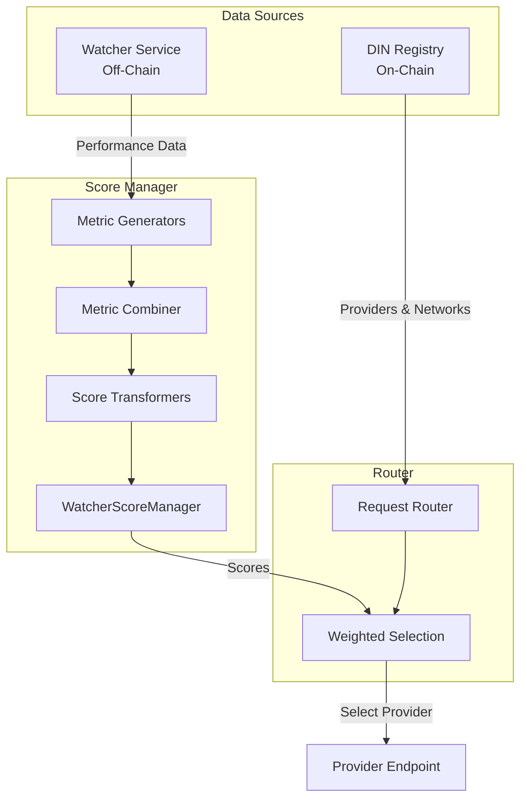
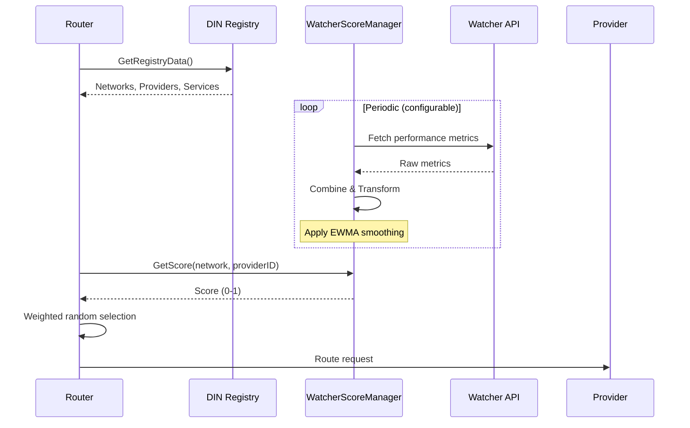
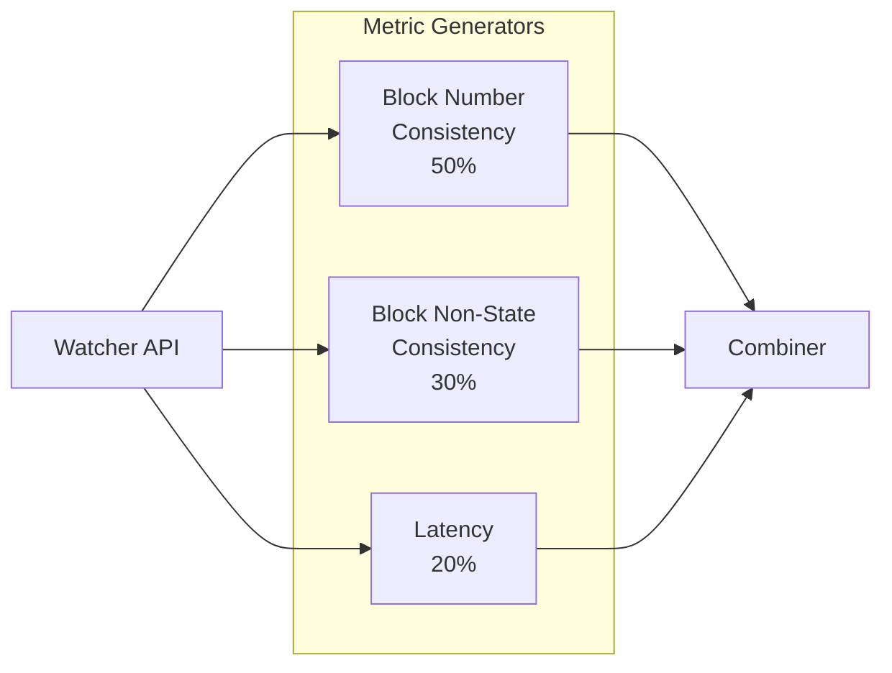
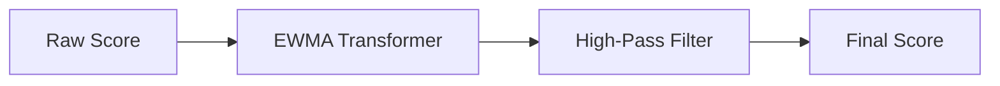
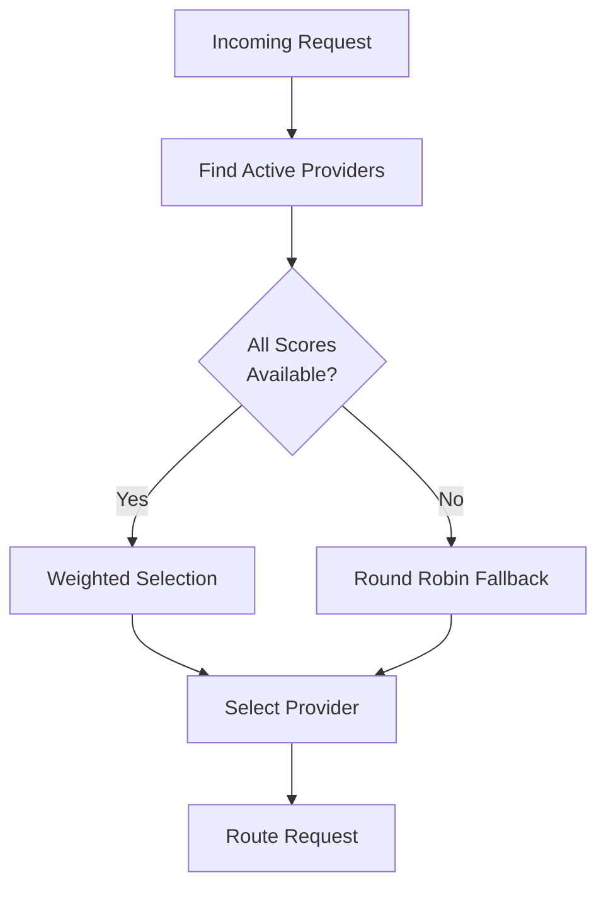
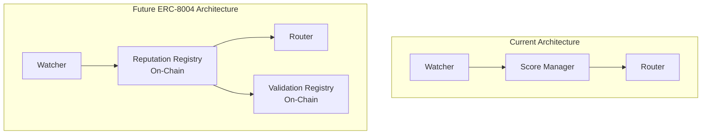

# Watcher Integration

This document describes how the watcher system integrates with the DIN Registry to provide performance-based routing.

## Overview

The watcher system monitors provider performance and generates quality scores that the router uses to make intelligent routing decisions. While the registry provides the source of truth for which providers exist and what services they offer, the watcher provides real-time performance data.



## Registry-Watcher Relationship

### Data from Registry

The registry provides:
- **Network definitions**: Which blockchain networks are available
- **Provider addresses**: Contract addresses for each provider
- **Service URLs**: Endpoint URLs where requests should be sent
- **Capabilities**: Which RPC methods each service supports
- **Status**: Whether networks/providers/services are active

### Data from Watcher

The watcher provides:
- **Block consistency**: How well a provider tracks the network's block height
- **Response consistency**: How reliable the provider's responses are
- **Latency**: How fast the provider responds to requests

### Integration Point



## Score Calculation Pipeline

### 1. Metric Generation

Three metric generators fetch data from the watcher service:

| Metric ID | Weight | Description |
|-----------|--------|-------------|
| `blockNumberConsistency` | 50% | How well the provider tracks the latest block |
| `blockNonStateConsistency` | 30% | Response consistency for non-state queries |
| `latency` | 20% | Response time (inverted so lower is better) |



### 2. Metric Combination

The `WeightedCombiner` combines metrics using a weighted average:

```
Score = (blockNumberConsistency × 0.5) +
        (blockNonStateConsistency × 0.3) +
        (latency × 0.2)
```

All individual metrics are normalized to [0, 1] where 1 is best.

### 3. Score Transformation

Scores are transformed through a pipeline:



**EWMA Transformer** (Exponential Weighted Moving Average):
- Smooths score fluctuations over time
- Prevents sudden routing changes from transient issues
- Uses formula: `S_t = α × Current + (1-α) × Previous`
- Default α = 0.5

**High-Pass Filter**:
- Filters out very low scores (below 0.001)
- Providers with near-zero scores are effectively excluded
- Prevents routing to severely degraded providers

## Score Data Structure

```go
// Score represents a provider's computed quality score
type Score struct {
    value       float64   // Score between 0 and 1
    hasValue    bool      // Whether the score is valid
    lastUpdated time.Time // When the score was computed
}

// ProviderMetric represents a single metric measurement
type ProviderMetric struct {
    metricID     string    // e.g., "blockNumberConsistency"
    network      string    // e.g., "Ethereum-Mainnet"
    providerName string    // e.g., "Alchemy"
    providerID   string    // Unique provider identifier
    providerURL  *url.URL  // Service endpoint
    value        float64   // Metric value [0, 1]
    lastUpdated  time.Time // Measurement timestamp
}
```

## Router Integration

The router uses scores for weighted random selection:



### Selection Algorithm

1. Get all active providers from registry
2. Fetch scores for each provider from score manager
3. Calculate selection weights (scores are already normalized)
4. Use weighted random selection to pick a provider

**Weighted Selection Formula**:
```
P(select provider_i) = score_i / Σ(all scores)
```

Example:
- Provider A: score 0.8
- Provider B: score 0.6
- Provider C: score 0.4

Selection probabilities:
- A: 0.8 / 1.8 = 44.4%
- B: 0.6 / 1.8 = 33.3%
- C: 0.4 / 1.8 = 22.2%

## Configuration

Key configuration constants:

```go
const (
    // Metric weights (must sum to 1.0)
    BlockNumberConsistencyWeight   = 0.5
    BlockNonStateConsistencyWeight = 0.3
    LatencyWeight                  = 0.2

    // EWMA smoothing factor (0-1, higher = more responsive)
    ScoreSmoothingFactor = 0.5

    // Latency thresholds
    HighLatencyInMillis = 1000.0 // 1 second
    LowLatencyInMillis  = 50.0   // 50ms

    // Minimum success rate for non-zero metric
    MaxAcceptableRequestSuccessPercentage = 90
)
```

## Future: Registry-Based Reputation

Currently, watcher scores are computed and stored off-chain. A future integration could store reputation data on-chain using ERC-8004's reputation registry pattern:



Benefits of on-chain reputation:
- Transparent scoring visible to all participants
- Immutable audit trail of provider performance
- Cross-application reputation portability
- Economic incentives through staking and slashing

See [08-erc8004-alignment.md](./08-erc8004-alignment.md) for detailed integration strategy.

## Mapping Registry Entities to Watcher

| Registry Entity | Watcher Identifier | Notes |
|----------------|-------------------|-------|
| Network name | `network` param | Used to scope metrics |
| Provider contract address | `providerID` | Unique identifier |
| NetworkService URL | `providerURL` | Endpoint being measured |
| Provider name | `providerName` | Human-readable label |

## Score Manager Usage

```go
// Initialize score manager with networks from registry
networks := []string{"Ethereum-Mainnet", "Polygon-Mainnet"}
scoreManager := watcherscore.NewWithBuiltInFormula(
    networks,
    watcherClient,
    logger,
)

// Start periodic score updates
stopChan := scoreManager.StartPeriodicUpdates(5 * time.Minute)

// Get score for routing decision
score := scoreManager.GetScore("Ethereum-Mainnet", providerID)
if score.HasValue() {
    // Use score.Value() for weighted selection
}

// Get all scores for a network
allScores := scoreManager.GetAllScores("Ethereum-Mainnet")
```

## Adding New Networks

When a new network is added to the registry:

```go
// After registry returns new network
err := scoreManager.AddNetworkWithBuiltInFormula(
    "New-Network",
    watcherClient,
)
```

The built-in formula includes:
- Three metric generators (block consistency, non-state consistency, latency)
- Weighted combiner (50/30/20)
- EWMA + High-pass transformer pipeline

## Monitoring and Debugging

The watcher score system logs detailed information:

```
[WATCHER_SCORE] Combining metric (weighted)
    metricID=blockNumberConsistency
    network=Ethereum-Mainnet
    provider=Alchemy
    weight=0.5
    value=0.95
    weightedValue=0.475

[WATCHER_SCORE] EWMA transformed score
    network=Ethereum-Mainnet
    providerID=0x1234...
    alpha=0.5
    currentScore=0.85
    previousScore=0.80
    newScore=0.825

[WATCHER_SCORE] Provider score
    network=Ethereum-Mainnet
    providerID=0x1234...
    isValid=true
    score=0.825
```

## Best Practices

1. **Score Refresh Rate**: Match to network block time (e.g., 12s for Ethereum, 2s for Polygon)

2. **Graceful Degradation**: If watcher is unavailable, fall back to round-robin

3. **New Providers**: New providers start with no score; use default weight until metrics accumulate

4. **Score Persistence**: Scores are currently in-memory; consider persistence for faster restarts

5. **Network Synchronization**: Ensure score manager's network list matches registry
