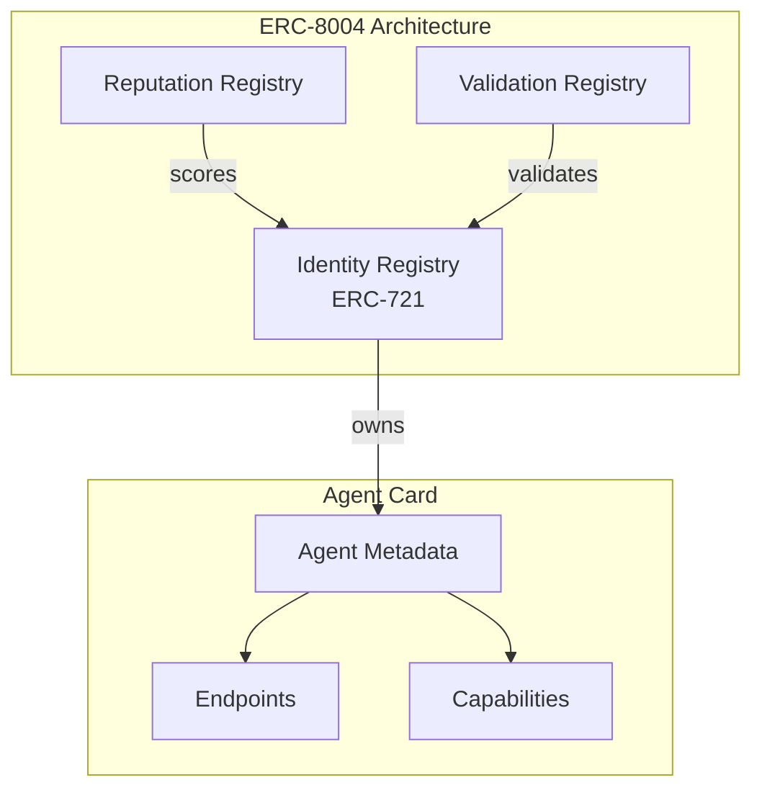
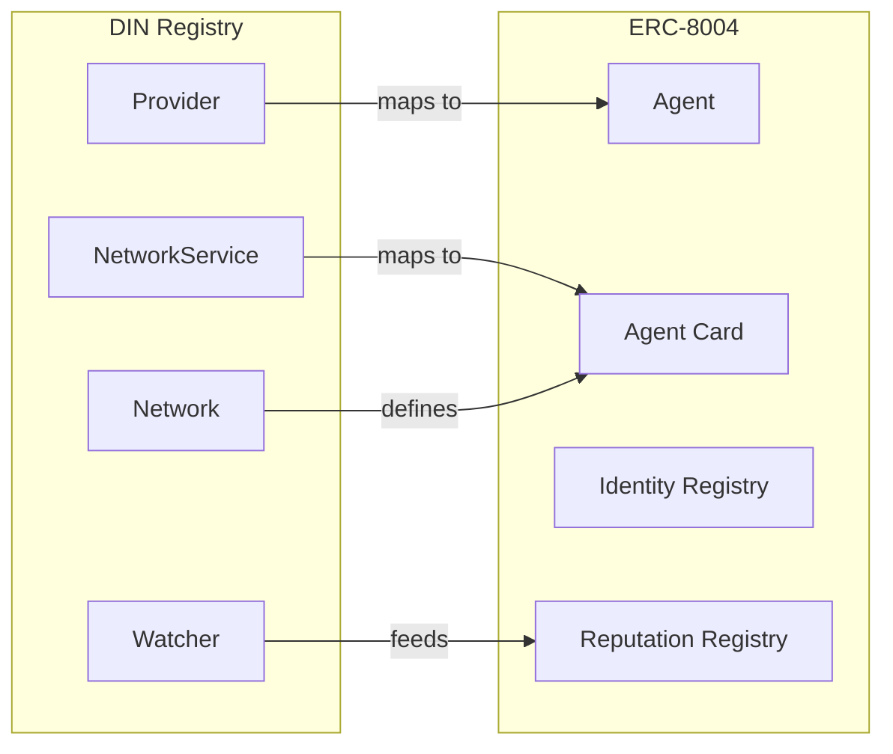
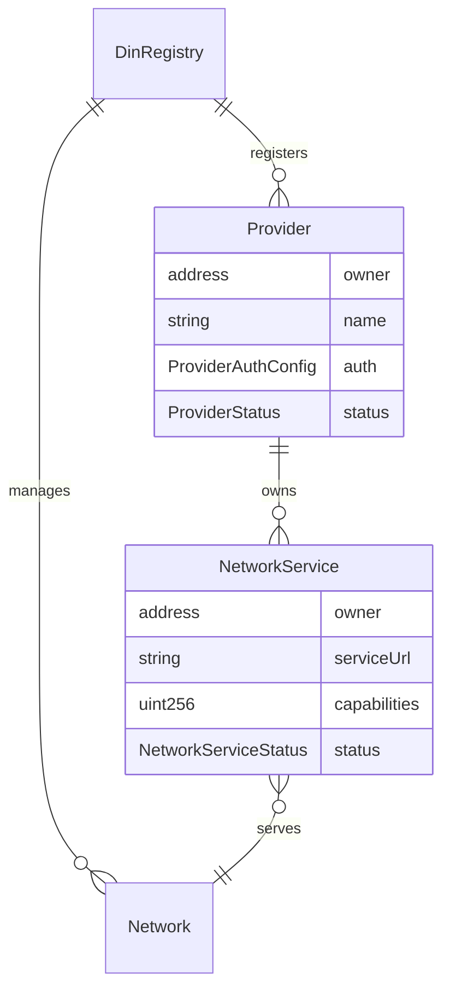
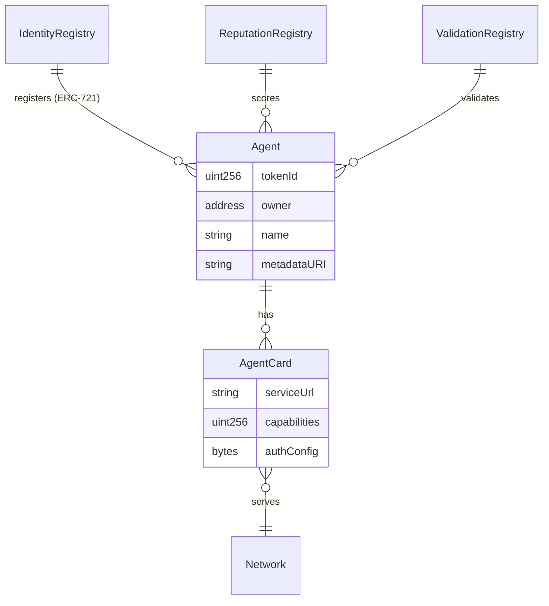
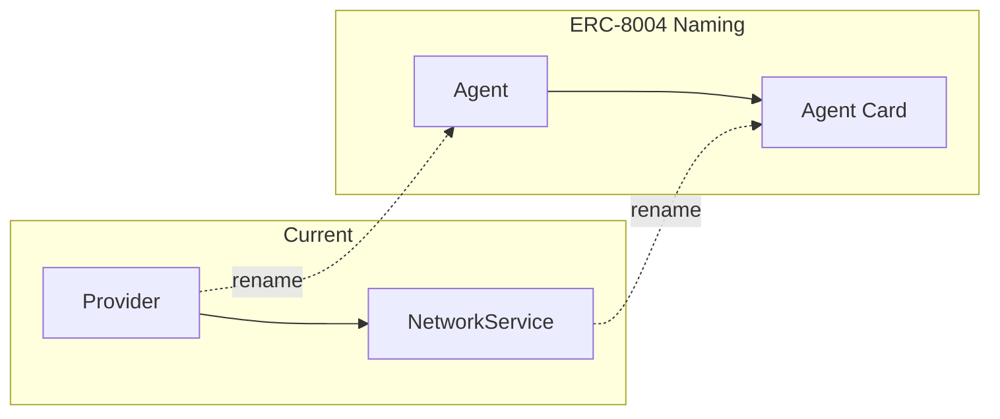
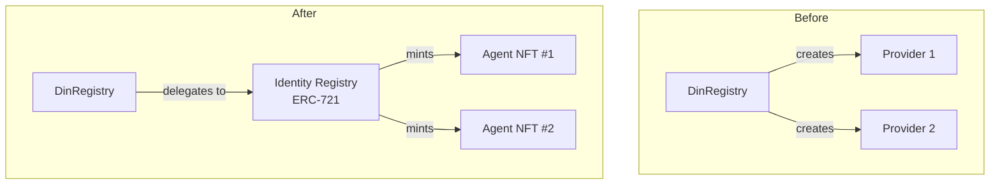
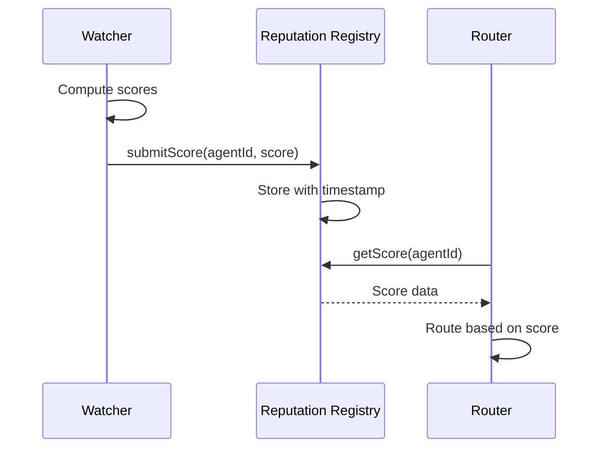
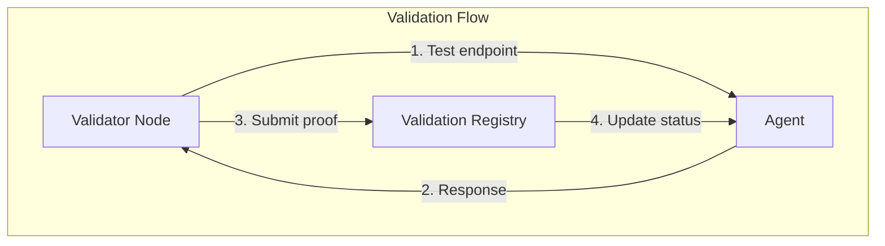
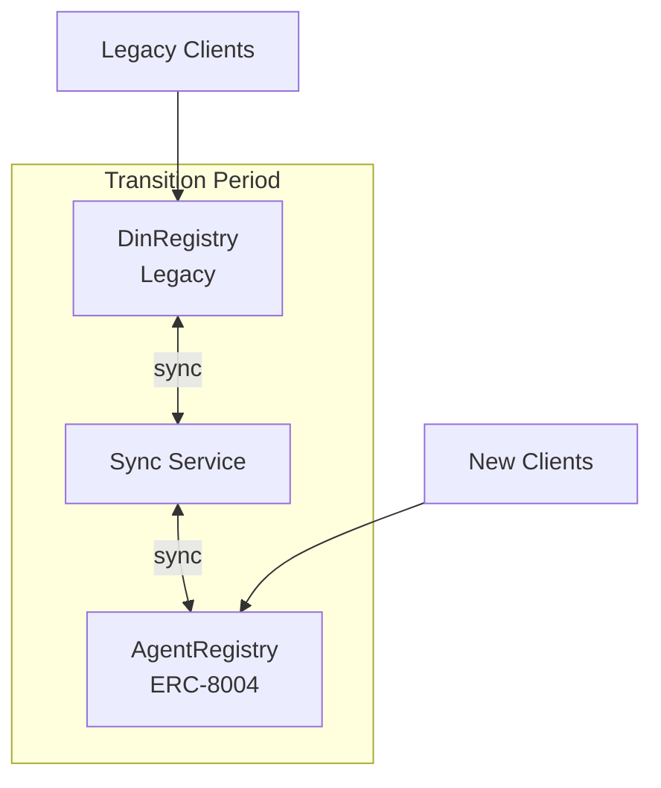
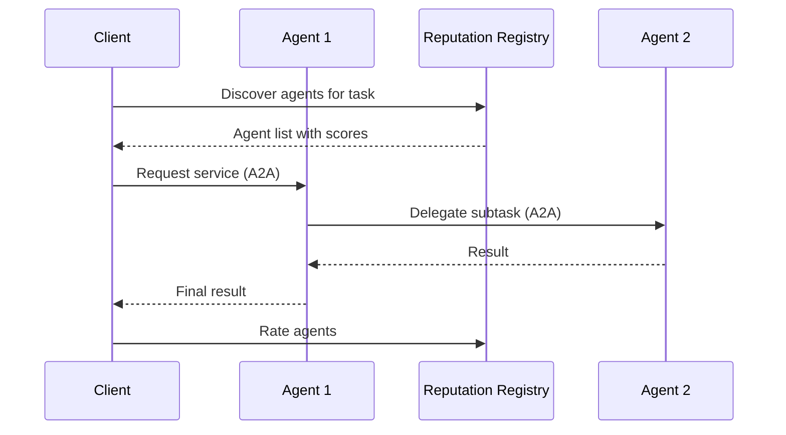

# ERC-8004 Alignment

This document analyzes how the DIN Registry aligns with ERC-8004 (Trustless Agents) and proposes an integration strategy.

## ERC-8004 Overview

ERC-8004 defines a standard for "Trustless Agents" - autonomous entities that can be discovered, validated, and rated on-chain. It introduces three core registries:



### Three Registries

| Registry | Purpose | Token Standard |
|----------|---------|----------------|
| **Identity Registry** | Register agents with unique IDs, store metadata | ERC-721 NFT |
| **Reputation Registry** | Track performance scores and history | Custom |
| **Validation Registry** | Verify agent behavior and compliance | Custom |

### Agent Card Concept

Each agent has an "Agent Card" containing:
- **Name and description**
- **Service endpoints** (URLs)
- **Capabilities** (what the agent can do)
- **Authentication requirements**
- **Reputation scores** (linked from Reputation Registry)

## DIN Registry vs ERC-8004

### Conceptual Mapping



| DIN Concept | ERC-8004 Equivalent | Notes |
|-------------|---------------------|-------|
| Provider | Agent | Service provider entity |
| NetworkService | Agent Card Endpoint | Service instance with URL |
| Network | Capability Domain | Defines available methods |
| Capabilities bitmask | Agent Capabilities | What the service supports |
| Provider Owner (EOA) | Agent Owner (NFT holder) | Who controls the entity |
| Watcher scores | Reputation Registry | Performance metrics |
| ProviderAuthConfig | Agent Auth Config | Authentication method |

### Current DIN Structure



### Proposed ERC-8004 Structure



## Integration Strategy

### Phase 1: Conceptual Alignment

No code changes required. Document how existing DIN concepts map to ERC-8004:



### Phase 2: Identity Registry Integration

Replace Provider contract with ERC-721 compliant Agent:



Benefits:
- Agents become tradeable/transferable NFTs
- Standard wallet support for agent management
- Composability with NFT ecosystem

### Phase 3: Reputation Registry Integration

Store watcher scores on-chain:



**Reputation Data Structure**:
```
ReputationRecord {
    agentId: uint256
    score: uint256 (scaled 0-10000)
    timestamp: uint256
    reporter: address
    metricType: bytes32
}
```

### Phase 4: Validation Registry

Add on-chain validation for:
- Provider endpoint availability
- Response correctness verification
- SLA compliance checking



## Proposed Contract Changes

### AgentRegistry (replaces Provider management)

```solidity
interface IAgentRegistry is IERC721 {
    struct AgentCard {
        string name;
        string serviceUrl;
        uint256 capabilities;
        bytes authConfig;
        AgentStatus status;
    }

    function registerAgent(
        address owner,
        string memory name,
        AgentCard memory card
    ) external returns (uint256 agentId);

    function updateAgentCard(
        uint256 agentId,
        AgentCard memory card
    ) external;

    function getAgentCard(uint256 agentId)
        external view returns (AgentCard memory);
}
```

### ReputationRegistry

```solidity
interface IReputationRegistry {
    struct ReputationRecord {
        uint256 score;        // 0-10000 (2 decimals)
        uint256 timestamp;
        address reporter;
        bytes32 metricType;
    }

    function submitScore(
        uint256 agentId,
        uint256 score,
        bytes32 metricType
    ) external;

    function getScore(uint256 agentId)
        external view returns (uint256 score);

    function getScoreHistory(uint256 agentId, uint256 count)
        external view returns (ReputationRecord[] memory);
}
```

## Migration Path

### Step 1: Dual Operation

Run both systems in parallel:



### Step 2: Data Migration

1. Snapshot existing providers and services
2. Mint Agent NFTs with matching data
3. Update Go client to support both registries
4. Migrate router to use new registry

### Step 3: Deprecate Legacy

1. Set DinRegistry to maintenance mode
2. Update documentation
3. Remove legacy contract references

## Benefits of ERC-8004 Alignment

### For DIN

| Benefit | Description |
|---------|-------------|
| **Standardization** | Common interface across agent ecosystems |
| **Transferability** | Provider ownership can be transferred |
| **Composability** | Integration with NFT marketplaces, DeFi |
| **Reputation Portability** | Scores usable across applications |
| **Validation Framework** | Standardized compliance checking |

### For Ecosystem

| Benefit | Description |
|---------|-------------|
| **Discovery** | Standard agent discovery patterns |
| **Interoperability** | Agents work across ERC-8004 applications |
| **Trust** | Shared reputation reduces cold-start |
| **Accountability** | On-chain audit trail |

## Challenges and Considerations

### Gas Costs

On-chain reputation updates are expensive:

| Operation | Estimated Gas |
|-----------|---------------|
| Register Agent | ~200,000 |
| Update Score | ~50,000 |
| Batch Update (10 agents) | ~300,000 |

**Mitigation**: Use rollups or batch updates.

### Score Update Frequency

Current watcher updates every 5 minutes. On-chain updates should be less frequent:

| Approach | Frequency | Trade-off |
|----------|-----------|-----------|
| Every update | 5 min | High cost, real-time |
| Hourly aggregates | 1 hour | Medium cost, delayed |
| Daily summaries | 24 hours | Low cost, stale data |
| Threshold-based | Variable | Cost-efficient, responsive |

### Centralization Risk

Who can submit reputation scores?

| Model | Description | Risk |
|-------|-------------|------|
| Single oracle | One trusted submitter | High centralization |
| Multi-sig | Committee approval | Medium centralization |
| Open submission | Anyone can submit | Sybil attack risk |
| Staked validators | Economic security | Complex, but decentralized |

## Recommended Approach

### Short Term (No Code Changes)

1. Document ERC-8004 mapping in this file
2. Use ERC-8004 terminology in new documentation
3. Consider ERC-8004 patterns in new features

### Medium Term

1. Implement IAgentRegistry interface wrapper
2. Add ERC-721 compatibility to Provider
3. Create reputation registry contract

### Long Term

1. Full ERC-8004 compliance
2. Migrate to standard Agent Card format
3. Integrate with A2A (Agent-to-Agent) protocol
4. Enable cross-application reputation

## A2A Protocol Integration

ERC-8004 is designed to work with the A2A protocol for agent communication:



This enables:
- Agent composition (agents calling agents)
- Task delegation and coordination
- Automated reputation updates based on interactions

## Conclusion

The DIN Registry is conceptually aligned with ERC-8004. The main gaps are:
1. Provider is not an ERC-721 token
2. Reputation is off-chain (watcher)
3. No validation registry

Adopting ERC-8004 would provide standardization, portability, and ecosystem integration benefits at the cost of increased gas costs and migration complexity.
