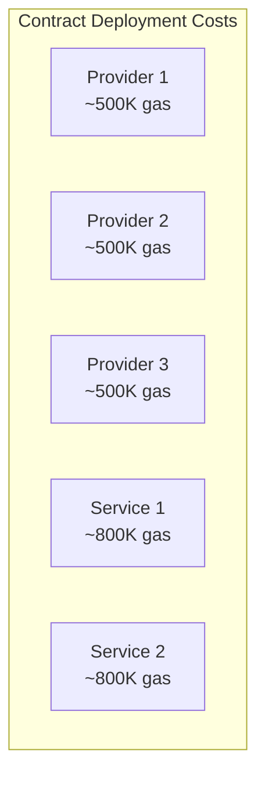
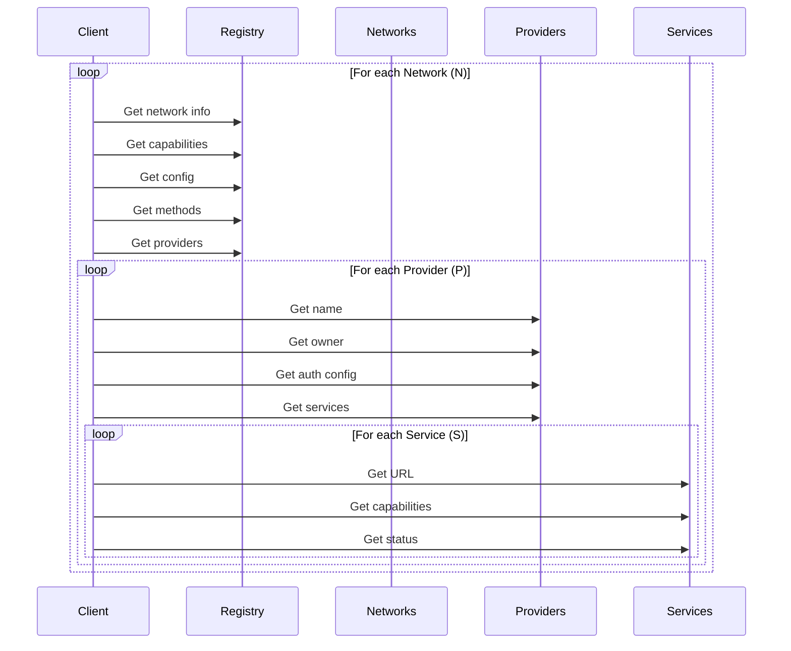
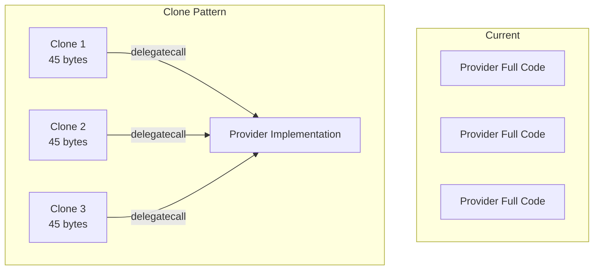
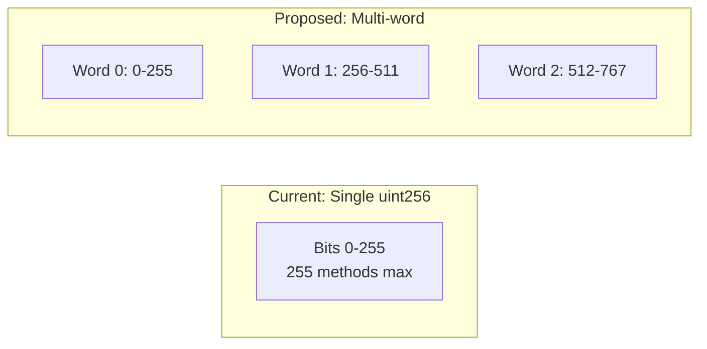
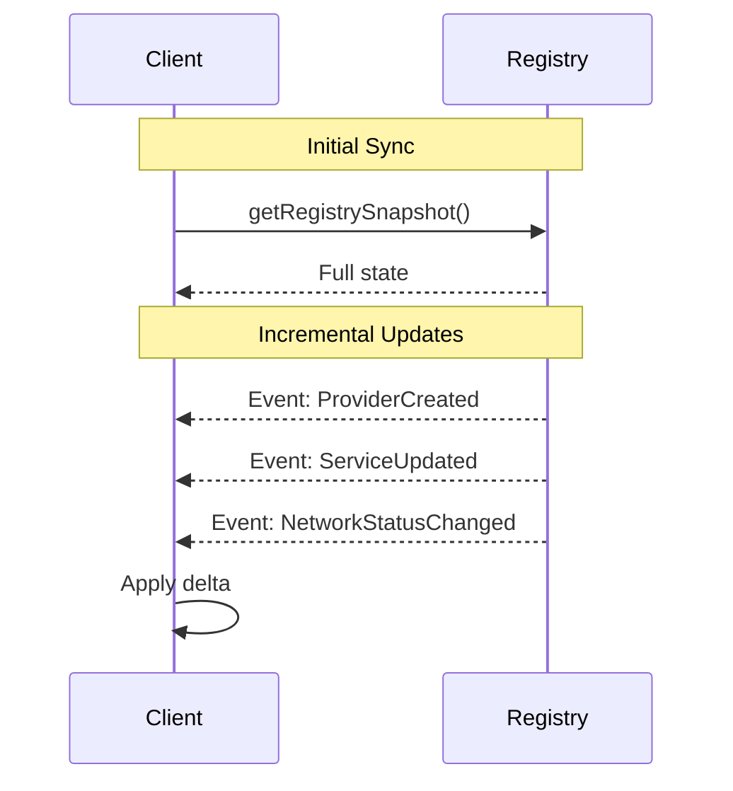

# Scalability Recommendations

This document identifies scalability bottlenecks in the DIN Registry and proposes solutions.

## Current Bottlenecks

### 1. Unbounded Array Returns

**Problem**: Functions like `getAllNetworks()`, `getAllProviders()`, and `getProviders()` return unbounded arrays.

```mermaid
graph LR
    subgraph "Current Pattern"
        C[Client] -->|getAllProviders| R[Registry]
        R -->|Provider[]| C
    end

    subgraph "Problem"
        P1[10 Providers<br/>✓ Works]
        P2[100 Providers<br/>⚠ Slow]
        P3[1000 Providers<br/>✗ Gas limit]
    end
```

**Impact**:
- Read calls may exceed gas limits
- Memory allocation scales with array size
- Response time increases linearly

**Current Code** (DinRegistry.sol):
```solidity
function getAllProviders() external view returns (Provider[] memory) {
    return providers;  // Returns entire array
}

function getProviders(string memory networkName) public view returns (Provider[] memory) {
    return network2providers[network];  // Returns unbounded array
}
```

### 2. O(N) Provider-Network Mapping Cleanup

**Problem**: Unregistering a provider requires iterating through all network mappings.

**Current Code** (DinRegistry.sol):
```solidity
function unregisterProvider(Provider provider) public {
    // ...
    // TODO: Not doing anything for now, but this should be rearchitected
    // The implementation is incomplete
}
```

**Impact**:
- Provider removal gas cost scales with network count
- Currently marked as TODO (incomplete)

### 3. Contract-per-Entity Model

**Problem**: Each Provider and NetworkService deploys a new contract.



**Impact**:
- High deployment costs (~500K-800K gas per entity)
- Bytecode duplication
- Limited to chain's contract size limits

### 4. Method Bit Limit

**Problem**: Methods are limited to 255 per network (uint8 bit positions).

**Impact**:
- Cannot support more than 255 RPC methods per network
- Some networks may exceed this limit

### 5. GetRegistryData() RPC Call Volume

**Problem**: Go client makes O(N×P×S) RPC calls to fetch full registry state.



**Impact**:
- Slow initial data fetch
- High RPC usage costs
- Poor UX during startup

## Recommended Solutions

### Solution 1: Pagination

Add paginated query functions:

```mermaid
graph LR
    subgraph "Paginated Pattern"
        C[Client] -->|getProviders(0, 10)| R[Registry]
        R -->|Provider[10]| C
        C -->|getProviders(10, 10)| R
        R -->|Provider[10]| C
    end
```

**Proposed Interface**:
```solidity
function getProvidersPaginated(
    uint256 offset,
    uint256 limit
) external view returns (
    Provider[] memory providers,
    uint256 total
);

function getNetworksPaginated(
    uint256 offset,
    uint256 limit
) external view returns (
    INetwork[] memory networks,
    uint256 total
);

function getProvidersByNetworkPaginated(
    string memory networkName,
    uint256 offset,
    uint256 limit
) external view returns (
    Provider[] memory providers,
    uint256 total
);
```

**Benefits**:
- Bounded gas usage per call
- Predictable response times
- Works at any scale

### Solution 2: Clone Pattern for Entity Deployment

Replace individual contract deployments with minimal proxy pattern:



**Gas Savings**:
| Entity | Current | With Clones | Savings |
|--------|---------|-------------|---------|
| Provider | ~500K | ~50K | 90% |
| NetworkService | ~800K | ~50K | 94% |

**Implementation** (using EIP-1167):
```solidity
import "@openzeppelin/contracts/proxy/Clones.sol";

contract DinRegistry {
    address public immutable providerImplementation;
    address public immutable serviceImplementation;

    constructor() {
        providerImplementation = address(new Provider());
        serviceImplementation = address(new NetworkService());
    }

    function createProvider(...) public returns (Provider) {
        address clone = Clones.clone(providerImplementation);
        Provider(clone).initialize(owner, name, authConfig);
        return Provider(clone);
    }
}
```

### Solution 3: Batch Read Function

Add a single function to fetch all registry data:

```solidity
struct RegistrySnapshot {
    NetworkData[] networks;
    ProviderData[] providers;
    ServiceData[] services;
}

struct NetworkData {
    address addr;
    string name;
    uint256 capabilities;
    NetworkStatus status;
    NetworkOperationsConfig config;
    string[] methodNames;
}

struct ProviderData {
    address addr;
    string name;
    address owner;
    ProviderAuthConfig auth;
    ProviderStatus status;
}

struct ServiceData {
    address addr;
    address provider;
    address network;
    string url;
    uint256 capabilities;
    NetworkServiceStatus status;
}

function getRegistrySnapshot()
    external view returns (RegistrySnapshot memory);
```

**Benefits**:
- Single RPC call for full state
- Reduces client complexity
- Eliminates O(N×P×S) call overhead

### Solution 4: Indexed Provider Removal

Replace linear search with indexed lookup:

```solidity
// Current
mapping(INetwork => Provider[]) public network2providers;

// Proposed: Add position tracking
mapping(INetwork => mapping(Provider => uint256)) public providerPosition;

function removeProviderFromNetwork(INetwork network, Provider provider) internal {
    uint256 pos = providerPosition[network][provider];
    uint256 lastPos = network2providers[network].length - 1;

    if (pos != lastPos) {
        Provider lastProvider = network2providers[network][lastPos];
        network2providers[network][pos] = lastProvider;
        providerPosition[network][lastProvider] = pos;
    }

    network2providers[network].pop();
    delete providerPosition[network][provider];
}
```

**Gas Savings**: O(N) → O(1)

### Solution 5: Expand Method Capacity

Replace uint8 bit with uint16 or use multiple uint256 bitmasks:



**Option A**: uint16 bit positions
```solidity
struct Method {
    string name;
    uint16 bit;  // Changed from uint8
    bool deactivated;
}
```

**Option B**: Multi-word capabilities
```solidity
uint256[] public capabilities;  // Array of bitmasks

function isMethodSupported(uint16 bit) public view returns (bool) {
    uint256 wordIndex = bit / 256;
    uint256 bitIndex = bit % 256;
    return (capabilities[wordIndex] & (1 << bitIndex)) > 0;
}
```

### Solution 6: Event-Based Sync

Use events for state synchronization instead of polling:



**Event Enhancement**:
```solidity
event ProviderCreated(
    address indexed provider,
    address indexed owner,
    string name,
    ProviderAuthConfig authConfig,
    ProviderStatus status
);

event ServiceCreated(
    address indexed service,
    address indexed provider,
    address indexed network,
    string url,
    uint256 capabilities
);
```

**Benefits**:
- Real-time updates without polling
- Reduced RPC load
- Historical state reconstruction from logs

## Implementation Priority

```mermaid
gantt
    title Scalability Implementation Roadmap
    dateFormat  X
    axisFormat %s

    section High Priority
    Pagination          :1, 2
    Batch Read          :2, 3

    section Medium Priority
    Clone Pattern       :3, 5
    Indexed Removal     :4, 5

    section Low Priority
    Method Expansion    :5, 6
    Event-Based Sync    :6, 7
```



| Priority | Solution | Impact | Effort |
|----------|----------|--------|--------|
| High | Pagination | Prevents gas limit failures | Low |
| High | Batch Read | 90%+ reduction in RPC calls | Medium |
| Medium | Clone Pattern | 90% deployment gas savings | Medium |
| Medium | Indexed Removal | O(1) provider removal | Low |
| Low | Method Expansion | Future-proofing | Low |
| Low | Event-Based Sync | Real-time updates | High |

## Capacity Planning

### Current Limits

| Resource | Current Limit | With Improvements |
|----------|---------------|-------------------|
| Networks | ~100 (gas limit) | 10,000+ (paginated) |
| Providers | ~500 (gas limit) | 50,000+ (paginated) |
| Methods/Network | 255 | 65,535 (uint16) |
| Services/Provider | Unbounded | Unbounded |
| RPC calls/sync | O(N×P×S) | O(1) (batch) |

### Recommended Thresholds

| Metric | Warning | Critical | Action |
|--------|---------|----------|--------|
| Total providers | 100 | 500 | Implement pagination |
| Services/network | 50 | 200 | Optimize queries |
| Methods/network | 100 | 200 | Plan expansion |
| Sync time | 5s | 30s | Implement batch read |

## Testing Recommendations

Before production deployment at scale:

1. **Load test with 1000+ providers**: Verify pagination works
2. **Measure gas at scale**: Profile all operations with large datasets
3. **Simulate full sync**: Time GetRegistryData with realistic data
4. **Stress test events**: Verify event-based sync handles high throughput
5. **Test clone upgrades**: Ensure implementation can be updated

## Conclusion

The current DIN Registry architecture works well for small deployments (<100 providers) but will encounter issues at scale. Implementing pagination and batch reads should be prioritized to support growth. The clone pattern and indexed removal are recommended for cost optimization. Method expansion and event-based sync can be deferred until needed.
