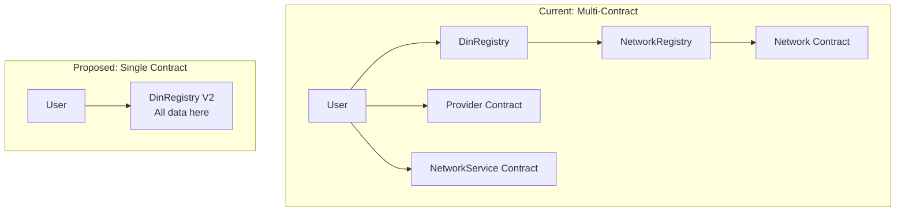
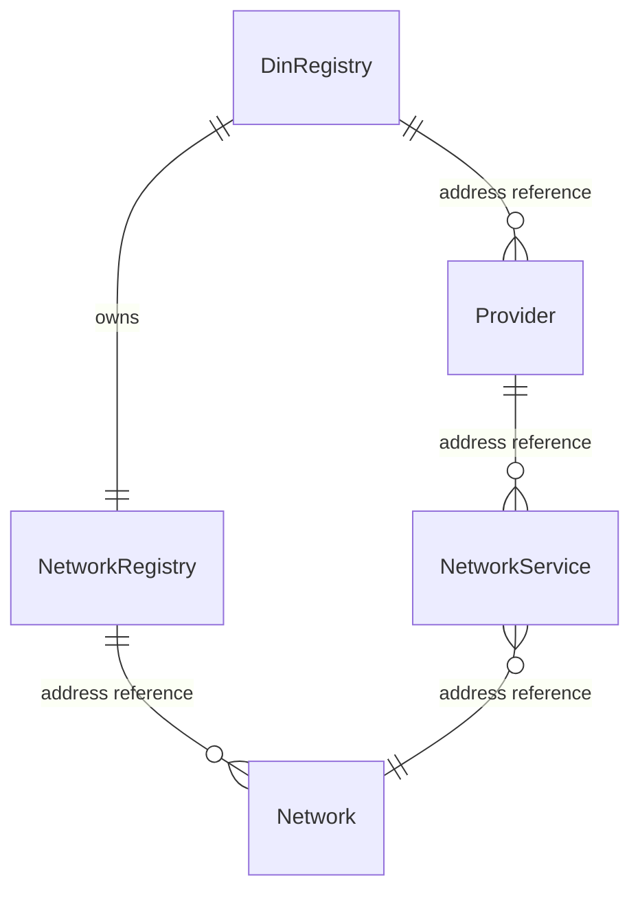
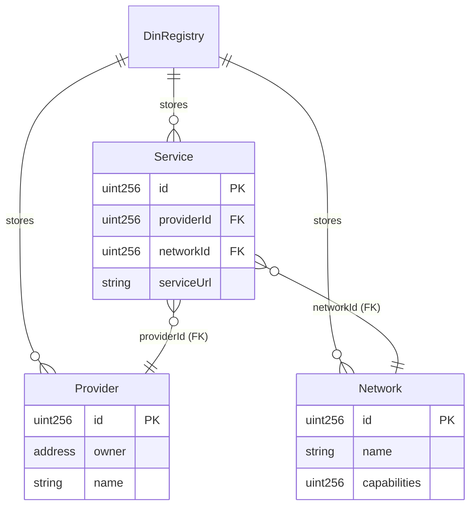

# Architectural Critique

This document provides a critical analysis of the DIN Registry design choices and proposes a comprehensive alternative architecture based on struct-based storage.

## Overview

The DIN Registry works for small-scale deployments, but several design choices would benefit from reconsideration. This document identifies patterns that add unnecessary complexity, cost, or limitations, and proposes a unified struct-based alternative.

## Target Deployment: Linea L2

DIN plans to deploy on Linea L2, which affects cost analysis:

| | Ethereum L1 | Linea L2 | Impact |
|---|-------------|----------|--------|
| Avg gas price | 30 gwei | 0.05-0.5 gwei | ~100x cheaper |
| Deploy Provider | ~$30 | ~$0.10 | Gas cost less critical |
| Deploy Service | ~$48 | ~$0.16 | Gas cost less critical |

**On L2, the economic argument for struct-based storage is weaker**, but the architectural benefits remain compelling.

---

## Critical Issues

### 1. Contract-per-Entity Pattern

**Current Design:**
```solidity
function createProvider(...) public onlyDinOwner returns (Provider) {
    provider = new Provider(providerEoa, name, authConfig, providerStatus);
    // Deploys ~500K gas, creates new contract address
}

function addNetworkService(...) returns (NetworkService) {
    service = new NetworkService(network, initialCaps, serviceUrl, status, providerOwner);
    // Deploys ~800K gas, creates new contract address
}
```

**Problems:**
- Each entity gets its own contract with duplicated bytecode
- Cross-contract calls add gas overhead
- Distributed state makes cleanup difficult
- Multiple ABIs for SDK to maintain

**Cost on Linea:**
| Entity | Current Gas | Cost on Linea |
|--------|-------------|---------------|
| Provider | ~500,000 | ~$0.10 |
| NetworkService | ~800,000 | ~$0.16 |
| 100 providers + 300 services | 290M | ~$58 |

While $58 isn't prohibitive, the architectural complexity remains.

---

### 2. Centralized Provider Creation

**Current Design:**
```solidity
function createProvider(...) public onlyDinOwner returns (Provider) {
    // Only DIN owner can create providers
}
```

**Problem:** Every new provider requires DIN admin intervention:
- Bottleneck for onboarding
- Single point of failure
- Centralization risk

---

### 3. Redundant Storage

**Current Design:**
```solidity
// DinRegistry.sol
INetwork[] public networks;
mapping(string => bool) public networkMap;

// NetworkRegistry.sol (created by DinRegistry)
mapping(string => NetworkRegistryEntry) internal s_name2network;
mapping(uint256 => NetworkRegistryEntry) internal s_id2network;
INetwork[] internal allNetworks;
```

**Problem:** Network data stored in both contracts - wasted storage and potential inconsistency.

---

### 4. String Keys are Gas-Inefficient

**Current Design:**
```solidity
mapping(string => bool) public networkMap;
function getProviders(string memory networkName) public view { ... }
```

**Problem:** String operations are expensive (variable length, O(n) comparison).

---

### 5. Immutable Service URL

**Current Design:**
```solidity
// NetworkService.sol - NO SETTER for serviceUrl
string public serviceUrl;
constructor(..., string memory _serviceUrl, ...) {
    serviceUrl = _serviceUrl;
}
```

**Problem:** Providers must recreate services to change URLs.

---

### 6. Incomplete Provider Unregistration

**Current Design:**
```solidity
function unregisterProvider(Provider provider) public ... {
    // TODO: Update provider-network mappings for each network.
    providerMap[provider] = false;
    // O(n) linear search for removal
}
```

**Problems:**
- `network2providers` mapping NOT cleaned up
- `providerNetworkMap` NOT cleaned up
- Uses O(n) search instead of O(1) indexed removal

---

### 7. Unbounded Array Returns

**Current Design:**
```solidity
function getAllProviders() external view returns (Provider[] memory) {
    return providers;  // Returns ENTIRE array
}
```

**Problem:** Will fail at scale (500+ items exceed gas limits).

---

### 8. 255 Method Limit

**Current Design:**
```solidity
uint8 private s_nextBit = 1;  // Max value: 255
```

**Problem:** Limited to 255 methods per network; deactivated methods consume positions forever.

---

### 9. Immutable Ownership

**Current Design:**
```solidity
address public immutable providerOwner;
address public immutable dinOwner;
```

**Problem:** Lost key = lost provider forever. No transfer mechanism.

---

### 10. NetworkRegistry Indirection

**Problem:** DinRegistry creates NetworkRegistry internally AND maintains its own arrays - unnecessary complexity.

---

## Recommended Architecture: Struct-Based Storage

### Core Principle: Single Contract, Relational Data

Instead of deploying contracts for each entity, store all data in a single registry contract using structs and mappings.



### Benefits of Single Contract

| Aspect | Multi-Contract | Single Contract |
|--------|----------------|-----------------|
| Contracts to deploy | 1 + N + M | 1 |
| ABIs to maintain | 5 | 1 |
| RPC calls for full sync | O(N×P×S) | O(1) to O(3) |
| State cleanup | Call each contract | Update mappings |
| Authorization logic | Distributed | Centralized |

---

## Proposed Data Model

### Entity Structures

```solidity
struct ProviderData {
    uint256 id;
    address owner;
    string name;
    ProviderAuthConfig auth;
    ProviderStatus status;
    uint256 createdAt;
}

struct ServiceData {
    uint256 id;
    uint256 providerId;    // Foreign key
    uint256 networkId;     // Foreign key
    string serviceUrl;
    uint256 capabilities;
    ServiceStatus status;
}

struct NetworkData {
    uint256 id;
    string name;
    string description;
    uint256 capabilities;
    NetworkStatus status;
    NetworkOperationsConfig config;
}
```

### Storage Layout

```solidity
contract DinRegistryV2 {
    // ============ Primary Storage (by ID) ============
    mapping(uint256 => ProviderData) public providers;
    mapping(uint256 => ServiceData) public services;
    mapping(uint256 => NetworkData) public networks;

    uint256 public nextProviderId = 1;  // 0 = not found
    uint256 public nextServiceId = 1;
    uint256 public nextNetworkId = 1;

    // ============ Secondary Indexes ============
    mapping(bytes32 => uint256) public providerNameToId;
    mapping(bytes32 => uint256) public networkNameToId;
    mapping(address => uint256[]) public ownerToProviders;
    mapping(uint256 => uint256[]) public providerToServices;
    mapping(uint256 => uint256[]) public networkToServices;
    mapping(bytes32 => uint256) public serviceKey;  // hash(providerId, networkId)
}
```

### Visual: Index Structure

```
┌─────────────────────────────────────────────────────────────────┐
│                     PRIMARY STORAGE                              │
├─────────────────────────────────────────────────────────────────┤
│  providers[1] = {id:1, owner:0xAAA, name:"Alchemy", ...}        │
│  providers[2] = {id:2, owner:0xBBB, name:"Infura", ...}         │
│                                                                  │
│  networks[1] = {id:1, name:"Ethereum-Mainnet", ...}             │
│  networks[2] = {id:2, name:"Polygon-Mainnet", ...}              │
│                                                                  │
│  services[1] = {id:1, providerId:1, networkId:1, url:"..."}     │
│  services[2] = {id:2, providerId:1, networkId:2, url:"..."}     │
└─────────────────────────────────────────────────────────────────┘

┌─────────────────────────────────────────────────────────────────┐
│                     SECONDARY INDEXES                            │
├─────────────────────────────────────────────────────────────────┤
│  providerNameToId:                                               │
│    hash("Alchemy") → 1                                           │
│    hash("Infura")  → 2                                           │
│                                                                  │
│  networkNameToId:                                                │
│    hash("Ethereum-Mainnet") → 1                                  │
│    hash("Polygon-Mainnet")  → 2                                  │
│                                                                  │
│  ownerToProviders:                                               │
│    0xAAA → [1]                                                   │
│    0xBBB → [2]                                                   │
│                                                                  │
│  providerToServices:                                             │
│    1 → [1, 2]  (Alchemy's services)                              │
│    2 → []      (Infura's services)                               │
│                                                                  │
│  networkToServices:                                              │
│    1 → [1]     (Ethereum services)                               │
│    2 → [2]     (Polygon services)                                │
└─────────────────────────────────────────────────────────────────┘
```

---

## Identity and Lookup Strategy

### Dual Identity: Numeric IDs + Name Indexes

| Query Type | Method | Cost |
|------------|--------|------|
| By ID | `providers[id]` | O(1) |
| By name | `providerNameToId[hash(name)]` → `providers[id]` | O(1) |
| By owner | `ownerToProviders[addr]` → loop | O(n) |
| By relationship | `providerToServices[id]` → loop | O(n) |
| Specific service | `serviceKey[hash(providerId, networkId)]` | O(1) |

### Lookup Functions

```solidity
// By ID (primary - most efficient)
function getProvider(uint256 id) external view returns (ProviderData memory) {
    require(providers[id].id != 0, "Provider not found");
    return providers[id];
}

// By name (human-friendly)
function getProviderByName(string calldata name) external view returns (ProviderData memory) {
    bytes32 key = keccak256(abi.encodePacked(name));
    uint256 id = providerNameToId[key];
    require(id != 0, "Provider not found");
    return providers[id];
}

// By owner (show my providers)
function getProvidersByOwner(address owner) external view returns (ProviderData[] memory) {
    uint256[] storage ids = ownerToProviders[owner];
    ProviderData[] memory result = new ProviderData[](ids.length);
    for (uint i = 0; i < ids.length; i++) {
        result[i] = providers[ids[i]];
    }
    return result;
}

// By relationship
function getProviderServices(uint256 providerId) external view returns (ServiceData[] memory) {
    uint256[] storage ids = providerToServices[providerId];
    ServiceData[] memory result = new ServiceData[](ids.length);
    for (uint i = 0; i < ids.length; i++) {
        result[i] = services[ids[i]];
    }
    return result;
}

// Specific service lookup
function getServiceByProviderAndNetwork(uint256 providerId, uint256 networkId)
    external view returns (ServiceData memory)
{
    bytes32 key = keccak256(abi.encodePacked(providerId, networkId));
    uint256 id = serviceKey[key];
    require(id != 0, "Service not found");
    return services[id];
}
```

---

## Authorization Model

### Current: Distributed Across Contracts

```solidity
// Provider.sol
modifier isAuthorized() {
    require(msg.sender == providerOwner || msg.sender == dinAddress, ...);
    _;
}

// NetworkService.sol
modifier onlyServiceOwner() {
    require(msg.sender == serviceOwner, ...);
    _;
}
```

### Proposed: Centralized in Registry

```solidity
contract DinRegistryV2 {
    address public dinOwner;

    modifier onlyDinOwner() {
        require(msg.sender == dinOwner, "Not DIN owner");
        _;
    }

    modifier onlyProviderOwnerOrDin(uint256 providerId) {
        require(
            msg.sender == providers[providerId].owner ||
            msg.sender == dinOwner,
            "Not authorized"
        );
        _;
    }

    modifier onlyServiceOwnerOrDin(uint256 serviceId) {
        uint256 providerId = services[serviceId].providerId;
        require(
            msg.sender == providers[providerId].owner ||
            msg.sender == dinOwner,
            "Not authorized"
        );
        _;
    }

    // Provider owner can manage their provider
    function setProviderStatus(uint256 providerId, ProviderStatus status)
        external onlyProviderOwnerOrDin(providerId)
    {
        providers[providerId].status = status;
        emit ProviderStatusUpdated(providerId, status);
    }

    // Provider owner can manage their services
    function setServiceUrl(uint256 serviceId, string calldata url)
        external onlyServiceOwnerOrDin(serviceId)
    {
        services[serviceId].serviceUrl = url;
        emit ServiceUrlUpdated(serviceId, url);
    }
}
```

**Authorization is preserved**: Provider owners control their own data, DIN owner has admin override.

---

## SDK Simplification

### Current Go Client

```go
// Multiple handler types, O(N×P×S) RPC calls
func (d *DinClient) GetRegistryData() (*DinRegistryData, error) {
    networkAddresses, _ := d.DinRegistry.GetAllNetworkAddresses()

    for _, networkAddress := range networkAddresses {
        networkHandler, _ := din.NewNetworkHandler(d.ethClient, networkAddress)
        // ... call network contract

        providers, _ := d.DinRegistry.GetProvidersByNetwork(networkName)
        for _, provider := range providers {
            // ... call provider contract

            serviceAddresses, _ := provider.GetAllNetworkServiceAddresses()
            for _, serviceAddress := range serviceAddresses {
                serviceHandler, _ := din.NewNetworkServiceHandler(d.ethClient, serviceAddress)
                // ... call service contract
            }
        }
    }
}
```

### Proposed Go Client

```go
// Single handler, O(1) to O(3) RPC calls
type DinClient struct {
    Registry *DinRegistryHandler  // Just one handler
}

func (d *DinClient) GetRegistryData() (*DinRegistryData, error) {
    // Option 1: Batch call
    snapshot, _ := d.Registry.GetRegistrySnapshot()
    return snapshot, nil

    // Option 2: Focused calls
    networks, _ := d.Registry.GetAllNetworks()
    providers, _ := d.Registry.GetAllProviders()
    services, _ := d.Registry.GetAllServices()
    // Assemble in memory...
}

// Simple lookups
func (d *DinClient) GetProvider(id uint64) (*Provider, error) {
    return d.Registry.GetProvider(id)
}

func (d *DinClient) GetProviderByName(name string) (*Provider, error) {
    return d.Registry.GetProviderByName(name)
}
```

---

## Data Topology Comparison

### Current: Object References



Relationships are **contract addresses**.

### Proposed: Foreign Keys



Relationships are **numeric IDs** (like a relational database).

---

## What's Actually Good (Keep These)

### Capability Bitmask System
```solidity
uint256 public capabilities;

function isMethodSupported(uint8 bit) public view returns (bool) {
    return (capabilities & (1 << bit)) > 0;
}
```
- O(1) method support checking
- Compact storage
- Efficient bitwise operations

### Event Emission
Most state changes emit events - keep this for off-chain indexing.

---

## Complete Comparison

| Aspect | Current | Proposed |
|--------|---------|----------|
| **Contracts to deploy** | 1 + N providers + M services | 1 |
| **Contracts to interact** | 5 types | 1 |
| **ABIs to maintain** | 5 | 1 |
| **Entity identity** | Contract address | Numeric ID |
| **Relationships** | Object references | Foreign keys |
| **Query pattern** | Follow references | Index lookups |
| **SDK complexity** | Multiple handlers | Single handler |
| **RPC calls for sync** | O(N×P×S) | O(1) to O(3) |
| **Authorization** | Each contract | Central registry |
| **State cleanup** | Call each contract | Update mappings |
| **Service URL update** | Impossible | Simple setter |
| **Ownership transfer** | Impossible | Simple update |

---

## Implementation Considerations

### Contract Size Limit (24KB)

A monolithic contract could exceed Solidity's 24KB limit.

**Mitigation:** Use libraries for logic:

```solidity
library ProviderLib {
    function create(...) internal returns (uint256) { ... }
    function update(...) internal { ... }
}

library ServiceLib {
    function create(...) internal returns (uint256) { ... }
    function update(...) internal { ... }
}

contract DinRegistryV2 {
    using ProviderLib for *;
    using ServiceLib for *;
}
```

### Index Consistency

Indexes must stay in sync with primary data:

```solidity
function deleteProvider(uint256 providerId) external onlyProviderOwnerOrDin(providerId) {
    ProviderData storage p = providers[providerId];

    // Remove from name index
    delete providerNameToId[keccak256(abi.encodePacked(p.name))];

    // Remove from owner index
    _removeFromArray(ownerToProviders[p.owner], providerId);

    // Delete services first
    uint256[] storage serviceIds = providerToServices[providerId];
    for (uint i = 0; i < serviceIds.length; i++) {
        _deleteService(serviceIds[i]);
    }
    delete providerToServices[providerId];

    // Delete provider
    delete providers[providerId];

    emit ProviderDeleted(providerId);
}
```

---

## Migration Path

1. **Deploy V2 alongside V1**: New contract, new address
2. **Migration script**: Read V1 state, populate V2
3. **Update SDK**: Support both during transition
4. **Deprecate V1**: Set to maintenance mode
5. **Final cutover**: Point all clients to V2

---

## Priority Assessment

Given Linea L2 deployment:

| Priority | Issue | Rationale |
|----------|-------|-----------|
| **High** | Incomplete unregisterProvider | Bug regardless of architecture |
| **High** | Unbounded arrays | Will fail at scale |
| **High** | Immutable service URL | Operational pain point |
| **Medium** | Struct-based refactor | Cleaner, but costs are low on L2 |
| **Medium** | Ownership transfer | Recovery mechanism needed |
| **Low** | String → bytes32 keys | Micro-optimization on L2 |
| **Low** | 255 method limit | Unlikely to hit soon |

---

## Conclusion

The struct-based architecture provides:

1. **Simpler integration** - One contract, one ABI, fewer RPC calls
2. **Cleaner data model** - Relational structure with foreign keys
3. **Preserved authorization** - Provider owners still control their data
4. **Easier maintenance** - Centralized state management
5. **Better SDK experience** - Simpler client code

On Linea L2, the gas savings are less critical, but the architectural benefits make the refactor worthwhile for long-term maintainability.
