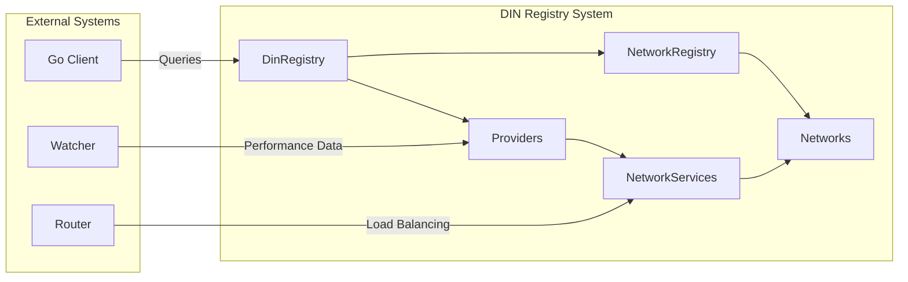

# DIN Registry Documentation

The DIN (Decentralized Infrastructure Network) Registry is a smart contract system for managing blockchain protocol interfaces and RPC provider services. It enables dynamic registration, configuration, and querying of blockchain networks and their RPC methods supported by various providers.

## Overview



The registry acts as a **service discovery mechanism** enabling:
- **Network Discovery**: Find all supported blockchain protocols
- **Method Discovery**: Query available RPC methods per network
- **Provider Discovery**: Find providers serving a specific network
- **Capability Matching**: Match service capabilities to requirements using bitmasks

## Quick Start

### Reading from the Registry (Go)

```go
import din "github.com/DIN-center/din-sc/apps/din-go/lib/din"

client, err := din.NewDinClient(logger, rpcURL, registryAddress)
if err != nil {
    return err
}

data, err := client.GetRegistryData()
for networkName, network := range data.Networks {
    fmt.Printf("Network: %s (%d providers)\n", networkName, len(network.Providers))
}
```

### Deploying the Registry

```bash
export DIN_OWNER_ACCOUNT=0xYourOwnerAddress
export RPC_URL=https://your-rpc-endpoint.com

forge script script/Deploy.s.sol:Deploy \
  --rpc-url $RPC_URL \
  --broadcast
```

## Documentation Index

| Document | Description |
|----------|-------------|
| [01 - Architecture Overview](./01-architecture-overview.md) | System architecture, contract hierarchy, ownership model |
| [02 - Contracts Reference](./02-contracts-reference.md) | Complete API reference for all contracts |
| [03 - Data Model](./03-data-model.md) | Data structures, relationships, and validation rules |
| [04 - Deployment Guide](./04-deployment-guide.md) | Step-by-step deployment instructions |
| [05 - Admin Operations](./05-admin-operations.md) | Access control, maintenance, and lifecycle management |
| [06 - Client Integration](./06-client-integration.md) | Go client usage with code examples |
| [07 - Watcher Integration](./07-watcher-integration.md) | Performance monitoring and routing integration |
| [08 - ERC-8004 Alignment](./08-erc8004-alignment.md) | Integration strategy with trustless agent standard |
| [09 - Scalability Recommendations](./09-scalability-recommendations.md) | Performance bottlenecks and optimization roadmap |
| [10 - Issues and Improvements](./10-issues-and-improvements.md) | Known issues and recommended changes |
| [11 - Architectural Critique](./11-architectural-critique.md) | Design analysis and struct-based architecture proposal |

### RFCs (Request for Comments)

| Document | Description | Status |
|----------|-------------|--------|
| [RFC-001 - Registry V2](./RFC-001-registry-v2.md) | Unified struct-based architecture proposal | Draft |

## Key Concepts

### Contracts

- **DinRegistry**: Central hub and main entry point for all operations
- **NetworkRegistry**: Internal registry managing Network contracts
- **Network**: Represents a blockchain protocol with RPC methods
- **Provider**: Represents an RPC service provider
- **NetworkService**: Links a Provider to a Network with specific capabilities

### Capability Bitmask

Methods are encoded as bits in a `uint256` bitmask for efficient storage and querying:

```
eth_blockNumber    → bit 1  → 0b00000010
eth_getBalance     → bit 2  → 0b00000100
Combined capability         → 0b00000110
```

Checking support: `(service.capabilities & required) == required`

### Ownership Hierarchy

```
DIN Owner (EOA)
├── Controls DinRegistry
│   ├── Creates Networks
│   └── Creates Providers
│
Provider Owner (EOA)
├── Controls their Provider
│   └── Creates NetworkServices
```

## Related Projects

| Project | Description |
|---------|-------------|
| [din-sc](../apps/din-sc/) | Smart contracts (Solidity/Foundry) |
| [din-go](../apps/din-go/) | Go client library |
| [din-caddy-plugins](https://github.com/DIN-center/din-caddy-plugins) | Caddy router with watcher integration |

## Contract Addresses

| Network | DinRegistry | Status |
|---------|-------------|--------|
| Mainnet | TBD | Not deployed |
| Sepolia | TBD | Not deployed |
| Local (Anvil) | Deployed via scripts | Development |

## License

MIT License - see [LICENSE](../../LICENSE) for details.
