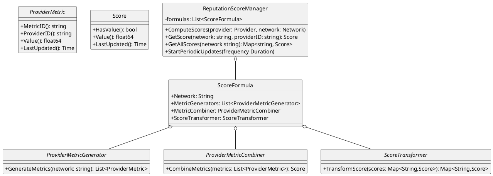
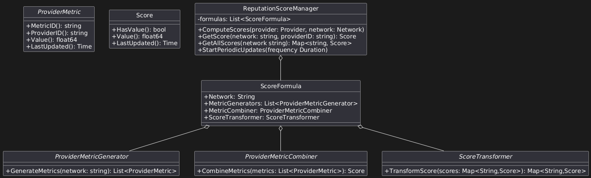
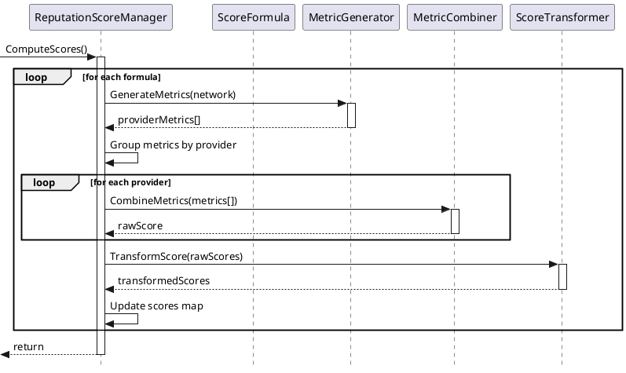
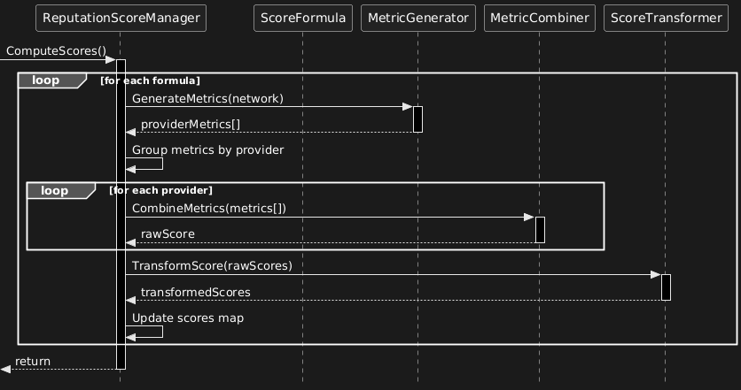

### DIP-001: Reputation Scores

@author: @noleto

@status: in review

date: 2025-01-24

## Introduction

The DIN Router currently routes traffic evenly among providers of the same priority level. “Evenly” means each eligible and healthy provider gets an equal share of the traffic. There’s no consideration of provider performance or data quality in this distribution.
This document proposes a way to improve the routing algorithm by introducing a “Provider Reputation Score” that reflects how well each provider is performing in terms of data consistency and latency over time. This score will be used to weight traffic distribution, so better-performing providers receive a proportionally larger share of requests. The ultimate goal: improve service quality for DIN developers.

## Reputation Scores

Reputation Scores are a way to assess the reliability of a JSON RPC Provider from a high level perspective. Providers will be measured based on a set of criteria, forming the "Provider Reputation Score." This score is calculated using data provided by Watchers, which perform regular checks and latency measurement. The criteria currently monitored by Watchers include:

- Block Number Consistency (BNC): This metric ensures that the block number either monotonically increases or remains consistent.
- Consistency of Non-State Data for a Block (CNSB): This metric verifies that non-state data for a given block hash remains consistent over time.
- Request Latency (L): This metric measures the elapsed time (in milliseconds) between sending a request and receiving a response, targeting the provider endpoint directly (without the DIN Router).

These metrics are evaluated per network and per provider. The formula to compute the Provider Reputation Score for a provider (e.g., P1) in a given network is:

$Φ({P1}) = BNC(P1) ⋅ W_{bnc} + CNSB({P1}) ⋅ W_{cnsb} + L({P1} | {P(95)})⋅  W_{lat}$,

Where:
* Φ (Phi) is the Reputation Score (range: [0,1])
* $W_{bnc}$, $W_{cnsb}$, $W_{lat}$ are the weights assigned to each metric (weights sum to 1)
* BNC, CNSB, and L are normalized metrics (range: [0,1]) for Block Number Consistency, Consistency of Non-State Data, and Latency at the 95th percentile, respectively and are provided by the Watcher

## Technical Details for the Reputation Score

The current proposal defines a set of abstractions and implementations to calculate the Reputation Score for a provider.

### Abstractions
- `ProviderMetric`: A provider metric is a number between 0 and 1 that can be used to measure the quality of a provider for a given criteria. For example, the block number consistency metric ensures the consistency rate of a provider's block number.
- `Score`: A score is a number in the range [0,1] that represents how well a provider is performing globally.
- `ProviderMetricGenerator`: A provider metric generator is responsible for generating the same metric type for all providers in a given network. In mathematical terms, a provider metric generator can be represented as a function: 

    $$\mathrm{PMG}(Network) \rightarrow [x_{p_1}, x_{p_2}, ..., x_{p_n}]$$ 
    where $x_{p_i}$ is a provider metric of type $x$ for provider $p_i$ and $Network$ is the network to which provider $p_i$ belongs.
- `ProviderMetricCombiner`: A provider metric combiner is responsible for combining (reducing) different types of metrics for a provider in a given network into a single score. In mathematical terms, a provider metric combiner can be represented as a function: 
    $$\mathrm{PMC}(x_{p_1}, y_{p_1}, ..., z_{p_1}) \rightarrow S_{p_1}$$ 
    where $S_{p_1}$ is a score for provider $p_1$ and $x_{p_1}, y_{p_1}, ..., z_{p_1}$ are the different metrics in the range [0,1] measured by the Watcher for provider $p_1$ in a given network.
- `ScoreTransformer`: A score transformer is responsible for transforming a set of scores in a input domain $K$ into another set of scores in a output domain $L$ by applying a mathematical function $\xi$. In mathematical terms, a score transformer can be represented as a function:
    $$\mathrm{ST}(S_1, S_2, ..., S_n) = \xi(S_1, S_2, ..., S_n) \rightarrow S_1', S_2', ..., S_n'$$
    where $S_1', S_2', ..., S_n'$ are the transformed scores in the output domain $L$ and $S_1, S_2, ..., S_n$ are the original scores in the input domain $K$. Note that domains $K$ and $L$ are both in the range [0,1].
- `ScoreFormula`: A score formula defines which components will be used to compute the score (a metric) and how to combine them to produce a score for a provider on a given network.

### Implementation

At the core of the reputation score algorithm is the `ReputationScoreManager` which is responsible for computing and storing the score for a provider on a given network. The `ReputationScoreManager` orchestrates the different components to compute the score but does not compute the score itself. It delegates the computation to the `ScoreFormula`s where all the logic is implemented.
The UML diagram below shows the relationship between the different components:

UML Source for Reputation Score Manager and its components

### Score Formula

The score formula is the abstraction that defines how to compute the score for a provider on a given network. The score formula is implemented as a `ScoreFormula` and is responsible for:
- Defining which metrics will be used to compute the score for a provider on a given network.
- Combining the metrics into a single score for a provider on a given network.
- Transforming the score into a final score for a provider on a given network.

Note that the score formula is defined per network. This means that each network will have its own score formula. The default implementation uses the same formula for all networks.

### Combiners and Transformers

As discussed in the [Abstractions](#abstractions) section, the `ProviderMetricCombiner` and `ScoreTransformer` are responsible for combining and transforming the metrics into a single score for a provider on a given network.
This encapsulation allows developers to implement their own combiners and transformers if they want to use a different system to collect the metrics or if they want to use a different formula to compute the score. By default, the system uses the combiner `WeightedCombiner` defined in the `combiners.go` file. The `WeightedCombiner` uses weights to aggregate the metrics into a single score such in the formula:

$$WC(M_1, M_2, ..., M_n) = M_1 ⋅ W_{m_1} + M_2 ⋅ W_{m_2} + ... + M_n ⋅ W_{m_n}$$

There are two transformers implemented:
- `NormalizeTransformer`: This transformer normalizes a set of score for different providers into a score that represents the percentage (in the range [0,1]) of the provider score in the total score. This ensures that the sum of all providerscores for a given network is 1.
- `EWMATransformer`: This transformer applies an Exponential Weighted Moving Average (EWMA) function to the score as a way to smooth the score over time. This is useful to avoid sudden changes in the score that could be caused by a single metric. See [Exponential Smoothing](https://en.wikipedia.org/wiki/Exponential_smoothing#Basic_(simple)_exponential_smoothing) for more details.

### Watcher metrics

The reputation score algorithm is completely agnostic to the system that is used to collect the metrics. The only requirement is that the metrics are in the range [0,1] and that they are available for each provider in a given network.

This proposal delivers a built-in score based on current Watcher metrics. The Watcher metrics are:
- `WatcherBlockNumberConsistency`: This is the implementation of the block number consistency metric.
- `WatcherConsistencyOfNonStateData`: This is the implementation of the consistency of non-state data metric.
- `WatcherRequestLatency`: This is the implementation of the request latency metric.

The Watcher metrics are implemented in the `watcher_metrics.go` file and require a Watcher client to fetch the raw data from the Watcher API. All the metrics are implemented as `ProviderMetricGenerator`s. This is the only link between the reputation score algorithm and the Watcher.

Note that Watchers don't provide "scores" but rather raw metrics. Developers are free to leverage the metrics provided by the Watcher to implement any derived score or monitoring system they want.

Also, developers can implement their own metrics by implementing the `ProviderMetricGenerator` interface and use any other system to collect the metrics (e.g. a custom monitoring system).

### Sequence diagram

The sequence diagram below shows the flow of the reputation score algorithm.

UML Sequence diagram for Reputation Score calculation

