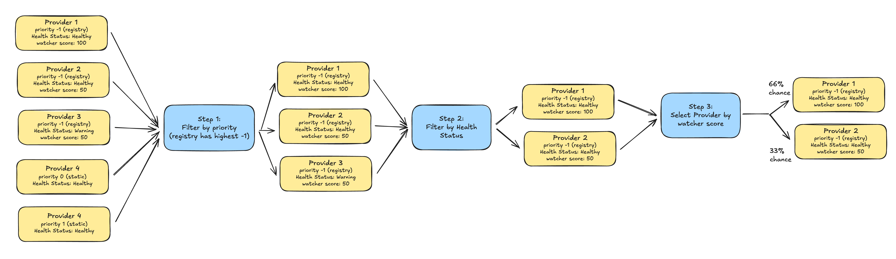
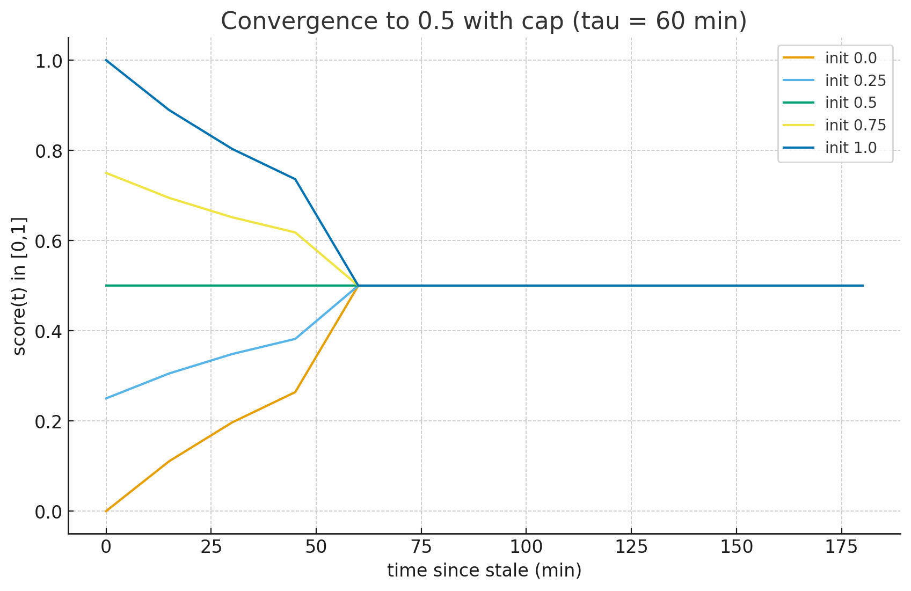
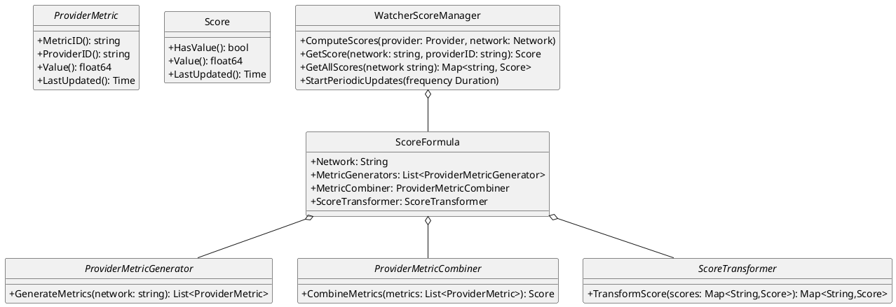
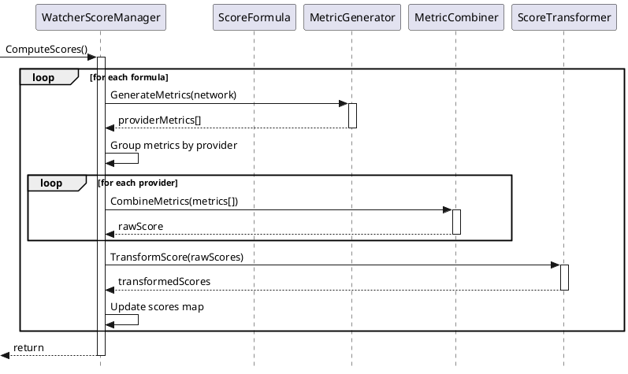

# DIN Router Dynamic Load Balancing

**Author:** @noleto  
**Status:** In review  
**Date:** 2025-01-24  
**Updated:** 2025-09-26  

## Executive Summary

Dynamic load balancing is an advanced feature for the DIN Router that intelligently distributes network traffic among providers based on their near real-time performance. Unlike the current DIN Router behavior, which doesn’t consider provider performance or data quality in its distribution, this new system automatically directs more traffic to better-performing providers, ensuring optimal service quality for DIN developers.
The system continuously monitors each provider's performance using three key metrics: data freshness, data accuracy, and response speed. These metrics are combined into a single score that determines how much traffic each provider receives.

## Overview

### What is Dynamic Load Balancing?

Dynamic load balancing is a traffic distribution method that adapts in near real-time to provider performance. Instead of splitting traffic equally among all providers, the system:

- **Monitors** each provider's performance continuously (Via Watcher observations)
- **Scores** providers based on their reliability and speed
- **Adjusts** traffic distribution proportionally to these scores
- **Ensures** users get routed to the best-performing providers

### Why Dynamic Load Balancing?

Currently, DIN Router load balancing treats all providers equally, regardless of their performance. This can lead to:
- Users experiencing slow responses from underperforming providers
- Errors from providers serving outdated or incorrect data
- Suboptimal resource utilization across the network

Dynamic load balancing solves these issues by continuously adapting to provider performance, ensuring that:
- High-performing providers receive more traffic
- Problematic providers receive less traffic until they recover
- Overall system reliability and speed improve

## How It Works

### High-Level Architecture



The dynamic load balancing system consists of three main components:

1. **Watcher Service**: Monitors provider performance
2. **Score Calculation**: Converts Watcher metrics into scores
3. **DIN Router**: Routes traffic based on scores

### The Monitoring Process

#### Step 1: Watcher Monitoring

The Watcher service continuously tests each provider every minute using three types of checks:

**1. Data Freshness Check (Block Number Consistency - BNC)**
- Ensures providers report the latest blockchain data
- Verifies block numbers always move forward
- Detects providers that are behind or serving stale data

**2. Data Accuracy Check (Consistency of Non-State Data - CNSB)**
- Verifies data consistency across multiple requests
- Ensures the same query returns the same result
- Identifies providers with unreliable or corrupted data

**3. Speed Check (Request Latency - RLAT)**
- Measures response times for common requests
- Tracks how quickly providers respond
- Ensures SLA requirements are met

#### Step 2: Score Calculation

Every 5 minutes, the system combines the monitoring results into a single Watcher Score (0-1 scale):

$$\text{Score} = \text{Freshness} \times 50\% + \text{Accuracy} \times 30\% + \text{Speed} \times 20\%$$

This weighting prioritizes data quality (freshness and accuracy) while still rewarding fast providers.

#### Step 3: Traffic Distribution

The DIN Router uses these scores to distribute incoming traffic:

- **Higher scores** → More traffic
- **Lower scores** → Less traffic
- **No score** → Default fair share (For new providers or when the Watcher service is not operating correctly)

The router uses a weighted random algorithm to ensure proportional distribution while maintaining randomness for load distribution.

## Configuration

### Basic Setup

Enable dynamic load balancing in your Caddyfile:

```caddy
dynamic_load_balancing {
    enabled true                                # Enable the feature
    watcher_endpoint https://watcher.din.com    # Watcher API endpoint
    watcher_api_key your_api_key               # API authentication
    sync_score_interval_secs 300               # How often to fetch new scores (seconds). If 0, sync is disabled.
}
```

### Configuration Parameters

| Parameter | Description | Default | Required |
|-----------|-------------|---------|----------|
| `enabled` | Enables dynamic load balancing | false | Yes |
| `watcher_endpoint` | URL of the Watcher API service | - | Yes (if enabled) |
| `watcher_api_key` | Authentication key for Watcher API | - | Yes (if enabled) |
| `sync_score_interval_secs` | How often to fetch new scores (seconds). If 0, sync is disabled. | 0 | No |

### Operational Behavior

#### Session Affinity
Session-based requests (with `Din-Session-Id` header) always route to the same provider, regardless of scores, ensuring session consistency (as previously defined in the DIN Router). 

#### New Providers
Newly registered providers without score history receive a default weight of 50, ensuring fair initial traffic distribution while the Watcher builds performance data.

#### Stale Data Handling
If Watcher data becomes unavailable:
1. **Grace Period (default 60 minutes)**: Continue using last known scores as source for weight
2. **After Grace Period**: Gradually revert to the default weight (currently set to 50) for affected providers within 60 minutes using the below curve. After that period, the weight is fixed at 50. 



3. **Recovery**: Resume score-based routing when data becomes available


## Technical Implementation Details

*This section is intended for system maintainers and developers.*

### Core Architecture

The dynamic load balancing system is built on a modular architecture with clear separation of concerns:

```
┌─────────────────────────────────────────────┐
│           WatcherScoreManager               │
│  ┌────────────────────────────────────┐     │
│  │         ScoreFormula                │     │
│  │  ┌──────────────────────────┐       │     │
│  │  │   MetricGenerators        │       │     │
│  │  │   - BNC Generator         │       │     │
│  │  │   - CNSB Generator        │       │     │
│  │  │   - Latency Generator     │       │     │
│  │  └──────────────────────────┘       │     │
│  │  ┌──────────────────────────┐       │     │
│  │  │   MetricCombiner          │       │     │
│  │  │   (WeightedCombiner)      │       │     │
│  │  └──────────────────────────┘       │     │
│  │  ┌──────────────────────────┐       │     │
│  │  │   ScoreTransformer        │       │     │
│  │  │   - EWMA Transformer      │       │     │
│  │  │   - HighPass Transformer  │       │     │
│  │  └──────────────────────────┘       │     │
│  └────────────────────────────────────┘     │
└─────────────────────────────────────────────┘
```

### Key Components
- `ProviderMetric`: A provider metric is a number between 0 and 1 that can be used to measure the quality of a provider for a given criteria. For example, the block number consistency metric ensures the consistency rate of a provider's block number.
- `Score`: A score is a number in the range [0,1] that represents how well a provider is performing globally.
- `ProviderMetricGenerator`: A provider metric generator is responsible for generating the same metric type for all providers in a given network. In mathematical terms, a provider metric generator can be represented as a function: 

    $$\mathrm{PMG}(Network) \rightarrow [x_{p_1}, x_{p_2}, ..., x_{p_n}]$$ 
    where $x_{p_i}$ is a provider metric of type $x$ for provider $p_i$ and $Network$ is the network to which provider $p_i$ belongs.
- `ProviderMetricCombiner`: A provider metric combiner is responsible for combining (reducing) different types of metrics for a provider in a given network into a single score. In mathematical terms, a provider metric combiner can be represented as a function: 
    $$\mathrm{PMC}(x_{p_1}, y_{p_1}, ..., z_{p_1}) \rightarrow S_{p_1}$$ 
    where $S_{p_1}$ is a score for provider $p_1$ and $x_{p_1}, y_{p_1}, ..., z_{p_1}$ are the different metrics in the range [0,1] measured by the Watcher for provider $p_1$ in a given network.
- `ScoreTransformer`: A score transformer is responsible for transforming a set of scores in a input domain $K$ into another set of scores in a output domain $L$ by applying a mathematical function $\xi$. In mathematical terms, a score transformer can be represented as a function:
    $$\mathrm{ST}(S_1, S_2, ..., S_n) = \xi(S_1, S_2, ..., S_n) \rightarrow S_1', S_2', ..., S_n'$$
    where $S_1', S_2', ..., S_n'$ are the transformed scores in the output domain $L$ and $S_1, S_2, ..., S_n$ are the original scores in the input domain $K$. Note that domains $K$ and $L$ are both in the range [0,1].
- `ScoreFormula`: A score formula defines which components will be used to compute the score (a metric) and how to combine them to produce a score for a provider on a given network.

### Implementation

At the core of the watcher score algorithm is the `WatcherScoreManager` which is responsible for computing and storing the score for a provider on a given network. The `WatcherScoreManager` orchestrates the different components to compute the score but does not compute the score itself. It delegates the computation to the `ScoreFormula`s where all the logic is implemented.
The UML diagram below shows the relationship between the different components:

<details><summary>UML Source for Watcher Score Manager and its components</summary>


</details>


### Score Formula

The score formula is the abstraction that defines how a score for a provider on a given network is computed. The score formula is implemented as a `ScoreFormula` and is responsible for:
- Defining which metrics will be used to compute the score for a provider on a given network.
- Combining the metrics into a single score for a provider on a given network.
- Transforming the score into a final score for a provider on a given network.

Note that the score formula is defined per network. This means that each network will have its own score formula. The default implementation uses the same formula for all networks.

### Combiners and Transformers

As discussed in the [Abstractions](#abstractions) section, the `ProviderMetricCombiner` and `ScoreTransformer` are responsible for combining and transforming the metrics into a single score for a provider on a given network.
This encapsulation allows developers to implement their own combiners and transformers if they want to use a different mathematical expression to compute the score. By default, the system uses the combiner `WeightedCombiner` defined in the `combiners.go` file. The `WeightedCombiner` uses weights to aggregate the metrics into a single score such in the expression:

$$WC(M_1, M_2, ..., M_n) = M_1 \times W_{m_1} + M_2 \times W_{m_2} + ... + M_n \times W_{m_n}$$


There are 3 transformers implemented:
- `HighPassThroughTransformer`: This transformer passes through scores above a given cutoff value. This is useful to avoid having providers with very low scores to be included in the routing algorithm. This is the default transformer.
- `EWMATransformer`: This transformer applies an Exponential Weighted Moving Average (EWMA) function to the score as a way to smooth the score over time. This is useful to avoid sudden changes in the score that could be caused by a single metric.
- `CompositeTransformer`: This applies the output of each transformer in the chain to the next transformer, then returns the final result.

### Watcher metrics

The watcher score algorithm is completely agnostic to the system that is used to collect the metrics. The only requirement is that the metrics are scaled to the range [0,1] and that they are available for each provider in a given network.

This proposal delivers a built-in score based on current Watcher metrics. The Watcher metrics are:
- `WatcherBlockNumberConsistency`: This is the implementation of the block number consistency metric.
- `WatcherConsistencyOfNonStateData`: This is the implementation of the consistency of non-state data metric.
- `WatcherRequestLatency`: This is the implementation of the request latency metric.

The Watcher metrics are implemented in the `watcher_metrics.go` file and require a Watcher client to fetch the raw data from the Watcher API. All the metrics are implemented as `ProviderMetricGenerator`s. This is the only link between the watcher score algorithm and the Watcher.

Note that Watchers don't provide "scores" but rather raw metrics. Developers are free to leverage the metrics provided by the Watcher to implement any derived score or monitoring system they want.

Also, developers can implement their own metrics by implementing the `ProviderMetricGenerator` interface and use any other system to collect the metrics (e.g. a custom monitoring system).

### Sequence diagram

The sequence diagram below shows the flow of the watcher score algorithm.

<details><summary>UML Sequence diagram for Watcher Score calculation</summary>


</details>


### Implementation Classes

#### Core Classes

```go
// WatcherScoreManager - Manages scores across networks
type WatcherScoreManager struct {
    scores   map[string]map[string]*Score
    formulas map[string]ScoreFormula
    logger   *zap.Logger
    mu       sync.RWMutex
}

// ScoreFormula - Defines score computation pipeline
type ScoreFormula struct {
    network          string
    metricGenerators []ProviderMetricGenerator
    metricCombiner   ProviderMetricCombiner
    scoreTransformer ScoreTransformer
}

// Score - Immutable score representation
type Score struct {
    value       float64
    hasValue    bool
    lastUpdated time.Time
}
```

#### Module Integration

The `DinScoreBasedSelector` integrates with Caddy's module system:

```go
type DinScoreBasedSelector struct {
    logger   *zap.Logger
    fallback reverseproxy.Selector
}
```

Key integration points:
- Registered as Caddy module: `din_score_based_selector`
- Fallback to `DinSelect` for session affinity
- Context-based provider score retrieval

## References

1. [Watcher API Documentation](https://www.notion.so/consensys/Watcher-API-V1-136fc61a326e80f4b266d06e7743cb96)
2. [Exponential Smoothing](https://en.wikipedia.org/wiki/Exponential_smoothing#Basic_(simple)_exponential_smoothing)
3. [Weighted Random Algorithm](https://dev.to/jacktt/understanding-the-weighted-random-algorithm-581p)