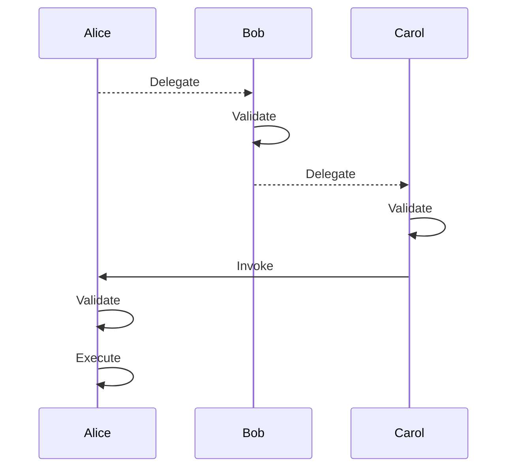

# Research: UCAN (User Controlled Authorization Networks) Specification

**Date**: 2025-12-17
**Git Commit**: 73ad4df (branch: plan/din-registry-sdk)
**Branch**: plan/din-registry-sdk
**Source**: `/Users/natefikru/go/src/din/spec` (UCAN Spec v1.0.0-rc.1)

## Research Question

Evaluate UCAN as a potential replacement for JWT in DIN's payment system where:
- Consumers deposit funds and start sessions (on-chain)
- Protocol issues access tokens to consumers
- Consumers use tokens to make RPC requests to provider sidecars
- Sidecars verify tokens (once per session, then cache)

## Executive Summary

UCAN (User-Controlled Authorization Network) is a trustless, secure, local-first, user-originated, distributed authorization scheme based on cryptographic capabilities. Unlike JWT which relies on centralized authorization servers, UCAN enables decentralized authority through delegation chains where authority flows from resource owners to delegates without intermediaries.

For DIN's payment system, UCAN offers several compelling advantages: it eliminates the need for a central authorization server, enables fine-grained capability delegation, provides built-in support for time-bounded access, and includes cryptographic proof chains that are self-verifying. However, it also introduces complexity in the form of delegation chain validation and requires careful consideration of revocation strategies.

## Detailed Findings

### 1. What is UCAN? Core Concepts

UCAN is fundamentally different from JWT in its authorization model:

**JWT (Access Control Lists)**
- Central Authorization Server (AS) sits between requestors and resources
- Server maintains a list of who can do what
- Like a "bouncer with a list" - you prove identity, bouncer checks list
- Requires coordination with central authority

**UCAN (Capability-Based)**
- No central Authorization Server
- Authority originates from resource owner and flows via delegation
- Like a "movie ticket" - possession of valid token grants access
- Self-verifying certificate chains

From `/Users/natefikru/go/src/din/spec/README.md:64-68`:
```
UCANs work more like movie tickets or a festival pass. No one needs to check
your ID; who you are is irrelevant. For example, if you have a ticket issued
by the theater to see Citizen Kane, you are admitted to Theater 3. If you
cannot attend an event, you can hand this ticket to a friend who wants to
see the film instead, and there is no coordination required with the theater
ahead of time.
```

**Key Architectural Difference** (from spec lines 86-95):
```
This inverts the usual relationship between resources and users: the resource
grants some (or all) authority over itself to agents, as opposed to an
Authorization Server managing the relationship between them. This has several
major advantages:

- Fully distributed and scalable
- Self-contained request without intermediary
- Partition tolerance, support for replicated data and machines
- Flexible granularity
- Compositionality: no distinction between resources residing together or apart
```

### 2. Key Features

#### 2.1 Capabilities

A capability is the association of an ability to a subject: `subject x command x policy`

From `/Users/natefikru/go/src/din/spec/README.md:339-353`:

| Field      | Example                                                                                      |
|------------|----------------------------------------------------------------------------------------------|
| Subject    | `did:key:z6MkhaXgBZDvotDkL5257faiztiGiC2QtKLGpbnnEGta2doK`                                   |
| Command    | `/msg/send`                                                                                  |
| Policy     | `["or", ["==", ".from", "mailto:me@example.com"], ["match", ".cc", "mailto:*@example.com"]]` |

#### 2.2 Commands (Abilities)

Commands are hierarchical and use path-like structure (spec lines 395-451):

- `/` - "Top" capability (like superuser - grants ALL abilities)
- `/crud` - All CRUD operations
- `/crud/read` - Just read
- `/msg/send` - Send messages

Shorter commands prove longer paths:
- `/crypto` can prove `/crypto/sign`
- `/crypto` cannot prove `/stack/pop` or `/cryptocurrency`

#### 2.3 Policy Language

Policies constrain capabilities with expressive conditions. From `/Users/natefikru/go/src/din/spec/fixtures/1.0.0/policy.json`:

```json
{
  "args": {
    "from": "alice@example.com",
    "to": ["bob@example.com", "carol@not.example.com"]
  },
  "policies": [
    [
      ["==", ".from", "alice@example.com"],
      ["any", ".to", ["like", ".", "*@example.com"]]
    ]
  ]
}
```

Supported operations:
- Equality: `==`, `!=`
- Comparison: `<`, `>`, `<=`, `>=`
- Pattern matching: `like` (glob patterns)
- Logical: `and`, `or`, `not`
- Quantifiers: `any`, `all`

#### 2.4 Delegation

Delegation allows passing authority from one agent to another. Key properties:

1. **Attenuation**: Each delegation can only maintain or reduce capabilities, never increase them
2. **Chain Validation**: Each link in the chain must be validated
3. **Subject Consistency**: The subject must remain consistent throughout the chain

From delegation fixture (`/Users/natefikru/go/src/din/spec/fixtures/1.0.0/delegation.json:9-31`):
```json
{
  "name": "basic delegation bob > carol",
  "envelope": {
    "payload": {
      "iss": "did:key:z6MkmT9j6fVZqzXV8u2wVVSu49gYSRYGSQnduWXF6foAJrqz",
      "aud": "did:key:z6MkmJceVoQSHs45cReEXoLtWm1wosCG8RLxfKwhxoqzoTkC",
      "sub": "did:key:z6MkmT9j6fVZqzXV8u2wVVSu49gYSRYGSQnduWXF6foAJrqz",
      "cmd": "/account",
      "pol": [],
      "exp": 1753353393,
      "nonce": "J20r9pHkJ/yoNirD"
    },
    "signature": "d7jvZs44lTWmjSG/PWBRXvAdJA6Pq0fj86WQOVBYSw3fLrpjF7OMvjUlTynZZblPHzFsiBeBlUqtbCAHvhppCQ==",
    "alg": "Ed25519",
    "enc": "DAG-CBOR"
  }
}
```

#### 2.5 Invocation

Invocation is how you exercise delegated authority. From invocation fixture, key validation rules:

| Error Type | Description |
|------------|-------------|
| `InvalidClaim` | No proofs provided when subject != issuer |
| `UnavailableProof` | Proof CID not resolvable |
| `Expired` | Proof or invocation has expired |
| `TooEarly` | `nbf` (not before) is in the future |
| `InvalidAudience` | Chain linkage broken (iss/aud mismatch) |
| `InvalidSubject` | Subject inconsistent across chain |
| `InvalidSignature` | Cryptographic signature invalid |
| `MatchError` | Invocation args violate policy |

Self-signed invocations are valid when `sub == iss`:
```json
{
  "description": "no proofs, the subject is the issuer so no proof is necessary",
  "name": "self signed"
}
```

### 3. Token Structure

#### 3.1 UCAN Envelope Format

From spec lines 546-583:

```
UCAN Envelope
├── Signature (raw bytes)
└── Signature Payload
    ├── Varsig Header (algorithm + encoding info)
    └── Token Payload
        └── ... fields
```

Concrete example:
```javascript
[
  { "/": {"bytes": "bdNVZn+uTrQ8..."}},  // Signature
  {
    "h": {"/": {"bytes": "NAHtAe0BE3E"}}, // Varsig header: Ed25519, DAG-CBOR
    "ucan/example@1.0.0-rc.1": {
      "hello": "world"
      // ... payload fields
    }
  }
]
```

#### 3.2 Payload Fields

From spec lines 587-600:

| Field   | Type                          | Required | Description                                |
|---------|-------------------------------|----------|--------------------------------------------|
| `iss`   | `DID`                         | Yes      | Issuer DID (sender)                        |
| `aud`   | `DID`                         | Yes      | Audience DID (receiver)                    |
| `sub`   | `DID`                         | Yes      | Subject - who the capability is about      |
| `cmd`   | `String`                      | Yes      | Command to invoke (e.g., `/rpc/call`)      |
| `args`  | `{String : Any}`              | Yes      | Arguments for the invocation               |
| `nonce` | `Bytes`                       | Yes      | Unique nonce (prevents replay)             |
| `meta`  | `{String : Any}`              | No       | Arbitrary metadata                         |
| `nbf`   | `Integer` (53-bits)           | No       | "Not before" Unix timestamp                |
| `exp`   | `Integer | Null` (53-bits)    | Yes      | Expiration Unix timestamp (null = never)   |

#### 3.3 Encoding & Cryptography

From spec lines 516-538:

| Role      | Required Algorithms               |
|-----------|-----------------------------------|
| Hash      | SHA-256                           |
| Signature | Ed25519, P-256, `secp256k1`       |
| DID       | `did:key`                         |
| Encoding  | DAG-CBOR (canonical for signing)  |
| CID       | CIDv1, base58btc, SHA-256         |

### 4. Delegation Chains - How They Work

#### 4.1 Chain Structure

```
Owner (root) --delegates--> Alice --delegates--> Bob --invokes-->
     [proof 2]                [proof 1]              [invocation]
```

Each delegation in the chain must satisfy:
1. `proof[n].aud == proof[n-1].iss` (audience of one = issuer of next)
2. `proof[n].sub == proof[n-1].sub` (subject consistent throughout)
3. `proof[n].cmd` proves `proof[n-1].cmd` (can only attenuate)
4. `proof[n].pol` is at least as restrictive as `proof[n-1].pol`
5. Time bounds: intersection of all `nbf`/`exp` ranges

#### 4.2 Validation Flow (from spec lines 231-245)



#### 4.3 Why Delegation Chains Matter

1. **No Central Authority**: Authority flows peer-to-peer without coordination
2. **Auditability**: Complete provenance log of how authority was obtained
3. **Least Privilege**: Each step can only maintain or reduce permissions
4. **Offline Capable**: Validation only requires cryptographic verification

### 5. Security Properties

#### 5.1 Guarantees UCAN Provides

1. **Public-Key Verifiability**: All tokens are cryptographically signed
2. **Non-Forgeability**: DIDs prevent namespace collisions and confused deputies
3. **Delegation Integrity**: Chain must be unbroken and properly attenuated
4. **Time Bounds**: Built-in expiration and "not before" support
5. **Replay Prevention**: Unique CID per token + nonce requirement

#### 5.2 Security Considerations (from spec lines 74-82)

```
Root capability issuers function as verifiable, distributed roots of trust.
The delegation chain is by definition a provenance log. Private keys themselves
SHOULD NOT move from one context to another. Keeping keys unique to each
physical device and unique per use case is RECOMMENDED to reduce opportunity
for keys to leak, and limit blast radius in the case of compromises. "Sharing
authority without sharing keys" is provided by capabilities.
```

#### 5.3 What UCAN Does NOT Provide

1. **Confinement**: Cannot guarantee knowledge of all sub-delegations
2. **PITM Protection**: No special protection against person-in-the-middle attacks
3. **Semantic Validity**: Structurally valid chain can be semantically invalid

From spec line 80:
```
The executor MUST verify the ownership of any external resources at execution time.
```

#### 5.4 Revocation

UCAN supports revocation but it breaks the offline/trustless model:
- Requires checking revocation status (online)
- Affects all downstream delegations
- Last resort mechanism

### 6. Application to DIN Payment System

#### Current System (JWT-based)

```
Consumer -> Protocol (AS) -> JWT -> Provider Sidecar
                  |
            Validates session
            Issues JWT
```

#### Potential UCAN-based System

```
Protocol (root) --delegates--> Consumer --invokes--> Provider Sidecar
                 [/rpc/call]              [with proof chain]
                 [session policy]

Provider Sidecar:
1. Verify signature chain (cryptographic)
2. Check time bounds
3. Validate policy against request
4. Cache validation result for session
```

#### Mapping DIN Concepts to UCAN

| DIN Concept | UCAN Mapping |
|-------------|--------------|
| Protocol | Root Subject (owns `/rpc/*` capabilities) |
| Consumer | Audience of delegation, Issuer of invocation |
| Provider Sidecar | Executor (validates and performs action) |
| Session | Delegation with time bounds + session policy |
| RPC Call | Invocation with `cmd=/rpc/call`, `args={method, params}` |

#### Example DIN UCAN Delegation

```javascript
{
  "iss": "did:key:zProtocolDID...",     // Protocol
  "aud": "did:key:zConsumerDID...",     // Consumer
  "sub": "did:key:zProtocolDID...",     // Protocol's RPC capability
  "cmd": "/rpc/call",
  "pol": [
    ["==", ".sessionId", "0x123..."],   // Session ID from on-chain
    ["<=", ".requestCount", 1000],       // Rate limiting via policy
    ["any", ".methods", ["like", ".", "eth_*"]]  // Allowed methods
  ],
  "nbf": 1702828800,                     // Session start
  "exp": 1702915200,                     // Session end (24h)
  "nonce": "random-bytes"
}
```

### 7. Comparison: JWT vs UCAN for DIN

| Aspect | JWT | UCAN |
|--------|-----|------|
| **Central Authority** | Required (AS issues tokens) | Optional (peer-to-peer delegation) |
| **Verification** | Verify signature + check claims | Verify chain + check policies |
| **Delegation** | Not native (requires new token from AS) | Native, built-in |
| **Fine-grained Policies** | Custom claims | Structured policy language |
| **Time Bounds** | `exp`, `nbf` | Same |
| **Revocation** | Token blacklist or short expiry | UCAN Revocation spec |
| **Encoding** | JSON (base64url) | DAG-CBOR (more compact) |
| **Crypto** | Various (HS256, RS256, etc.) | Ed25519, P-256, secp256k1 |
| **Identity** | Arbitrary `sub` claim | DIDs (`did:key`) |
| **Interoperability** | Very high (ubiquitous) | Growing (IPFS ecosystem) |
| **Complexity** | Lower | Higher (chain validation) |

### 8. Recommendations for DIN

#### Advantages of UCAN for DIN

1. **Decentralized**: Aligns with web3/blockchain ethos
2. **Session Policies**: Rich policy language for rate limiting, method filtering
3. **Proof of Authority**: Clear chain showing how access was granted
4. **DID-based Identity**: Integrates well with wallet-based identity
5. **secp256k1 Support**: Native support for Ethereum-style keys

#### Challenges of UCAN for DIN

1. **Library Maturity**: Fewer production implementations than JWT
2. **Learning Curve**: More complex mental model than JWT
3. **Revocation Complexity**: If needed, adds online dependency
4. **Chain Overhead**: Each request carries proof chain (or CID references)

#### Recommended Approach

For DIN's specific use case (session-based, cached verification), a **hybrid approach** may be optimal:

1. **Use UCAN for Session Establishment**:
   - Protocol issues UCAN delegation to Consumer
   - Contains session policies (rate limits, allowed methods)
   - Consumer stores this delegation

2. **Simplified Invocation**:
   - First request includes full proof chain
   - Sidecar validates chain, caches result
   - Subsequent requests use session ID reference

3. **Leverage Existing secp256k1 Keys**:
   - Consumers can use existing Ethereum wallets
   - `did:key` with secp256k1 encoding

## Code References

- Main UCAN spec: `/Users/natefikru/go/src/din/spec/README.md`
- Delegation fixtures: `/Users/natefikru/go/src/din/spec/fixtures/1.0.0/delegation.json`
- Invocation fixtures: `/Users/natefikru/go/src/din/spec/fixtures/1.0.0/invocation.json`
- Policy fixtures: `/Users/natefikru/go/src/din/spec/fixtures/1.0.0/policy.json`
- Cryptosuite design: `/Users/natefikru/go/src/din/spec/design/cryptosuite.md`

## Open Questions

1. **Revocation Strategy**: How critical is revocation for DIN? If sessions are short-lived (24h), expiration may suffice.

2. **Proof Transport**: Should proofs be sent with each request, or stored/referenced by CID?

3. **Policy Complexity**: What policies does DIN actually need? Rate limits? Method filtering? Provider selection?

4. **Key Management**: Will consumers use existing Ethereum wallets or generate separate keys?

5. **Library Selection**: Which UCAN implementation to use? Options include:
   - TypeScript: `@ucanto/core` (Storacha/IPFS)
   - Go: `go-ucan` (various implementations)
   - Rust: `rs-ucan`

6. **Backwards Compatibility**: Can UCAN coexist with existing JWT-based auth during migration?

## Conclusion

UCAN is a sophisticated capability-based authorization system that aligns well with DIN's decentralized architecture. Its support for delegation chains, rich policy language, and secp256k1 cryptography make it a compelling choice. However, the added complexity should be weighed against DIN's specific requirements. For a system where sessions are established once and cached, UCAN's benefits (clear provenance, flexible policies, no central AS) may outweigh the implementation complexity.

The recommended path forward is to prototype a UCAN-based session establishment flow and evaluate:
1. Token size impact on first request
2. Validation performance (chain verification)
3. Developer experience with available libraries
4. Integration with existing Ethereum wallet infrastructure
