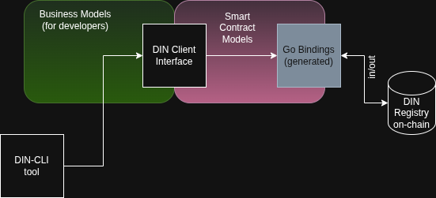

# DIN Go Client

The DIN Go client library provides a developer-friendly interface for interacting with DIN Registry smart contracts. It enables seamless reading from and writing to the DIN Registry on-chain, abstracting away the underlying Solidity models and Go bindings. The library offers type-safe, intuitive enums and models, making it easy for developers to work with DIN without dealing with low-level contract details.

---

## Architecture Overview

The DIN client is designed with a clear separation of concerns, as illustrated below:



- **Business Models (for developers):**  
  High-level, user-friendly Go types and enums that represent DIN concepts. These models are designed for ease of use and are agnostic to the underlying smart contract implementation.

- **DIN Client Interface:**  
  The main entry point for developers. The interface exposes methods to interact with the DIN Registry, using business models as input and output. It hides all boilerplate and internal details, providing a clean API surface.

- **Smart Contract Models:**  
  Internal representations that map closely to the on-chain data structures. These models are used by the client to translate between business models and the actual smart contract bindings.

- **Go Bindings (generated):**  
  Auto-generated Go code that provides low-level access to the smart contracts, created from Solidity ABIs. These bindings are not exposed directly to developers using the DIN client.

---

## DIN Client Interface

The `IDinClient` interface is the primary way to interact with the DIN Registry. It provides methods for common operations such as registering, updating, and querying DIN records. The interface is designed to be intuitive and type-safe, allowing developers to focus on business logic rather than contract details.

### `IDinClient` Methods

```go
GetRegistryData() (*DinRegistryData, error)
    // Retrieves the current DIN Registry data from the blockchain.

GetLatestBlockNumber() (uint64, error)
    // Retrieves the latest block number for the registry source.

GetAllNetworks() ([]*Network, error)
    // Returns a list of all registered networks.

GetProviderByAddress(providerAddress common.Address) (*Provider, error)
    // Fetches provider details by their Smart Contract address.

GetNetworkByName(networkName string) (*Network, error)
    // Retrieves a network by its  (URI).

SetNetworkStatus(auth *bind.TransactOpts, networkURI string, networkStatus NetworkStatus) error
    // Updates the status of a network (requires authorization).

SetProviderStatus(authTransactor *bind.TransactOpts, providerAddr common.Address, providerStatus ProviderStatus) error
    // Updates the status of a provider (requires authorization).

CreateAuthorizedTransactor(keystorePath, password string) (*bind.TransactOpts, error)
    // Creates a transaction authorizer from a keystore file and password.

GetAllProvidersByNetwork(networkURI string) ([]*Provider, error)
    // Lists all providers associated with a specific network.

GetAllProviders() ([]*Provider, error)
    // Lists all providers in the registry.

RemoveProvider(auth *bind.TransactOpts, providerAddr common.Address) error
    // Removes a provider from the registry (requires authorization).

SetNetworkConfig(authTransactor *bind.TransactOpts, networkURI string, newConfig NetworkOperationsConfig) error
    // Updates the configuration for a network (requires authorization).
```

---

## Models

### Business Models

Business models are Go structs and enums that represent DIN concepts in a way that is easy for developers to understand and use. They abstract away the complexity of the underlying smart contract data structures, providing a clean and stable API.

### Smart Contract Models

Smart contract models are internal types that closely mirror the data structures defined in the Solidity contracts. They are used by the client to translate between business models and the Go bindings generated from the contract ABIs.

---

## Go Bindings

Go bindings are generated from the Solidity contract ABIs using the `abigen` tool. These bindings provide low-level access to the smart contract functions and events. In this project, the bindings are generated automatically as part of the build process, and the resulting artifacts are placed under:

```
apps/din-go/pkg/dinregistry/sc_models
```

Developers using the DIN client do not need to interact with these bindings directly; all interactions should go through the DIN client interface and business models.

---

## Development

For developers working on the Monodin codebase:

- Go bindings for the DIN smart contracts are generated automatically during the project build.
- The generated files are located in `apps/din-go/pkg/dinregistry/sc_models`.
- To regenerate the bindings manually, run the command `pnpm run build:all` from the monodin root folder
- All business logic and application code should use the DIN client interface and business models, not the generated bindings or smart contract models directly (as internal bindings are subject to change).
